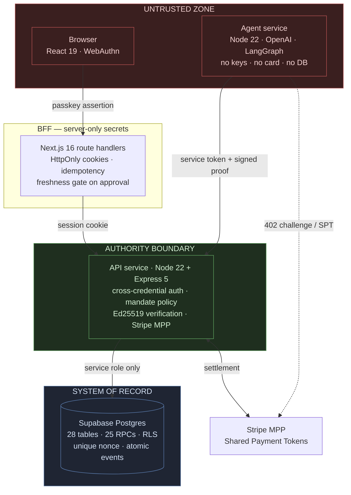

# Nomad

**Agentic commerce for buyers and sellers.** A fixed-price commerce operating system where people set the rules and AI agents execute with proof.

> Buyers define the mandate. Merchants publish exact product data and one fixed price. Nomad turns that agreement into a verifiable purchase.

NextWave Hackathon 2026 · Yuno × Nauta · **Track 01 — The Buyer Who Isn't Human**

---

## For the judge: the 60-second version

Payment systems assume the person pressing "pay" is the buyer. Nomad replaces that assumption with a **mandate**: a signed, versioned, revocable authorization that says what an agent may buy, up to how much, until when, and from whom.

The one sentence that describes the whole system:

> **The agent never holds spending power. It holds a signature, and the signature is evidence — not permission.**

Every purchase is authorized by the *backend*, at the moment of decision, against the *current* mandate state in Postgres. The agent cannot widen its own scope, cannot skip a check, cannot replay a proof, and cannot see a card number. If you revoke a mandate mid-run, the next poll — three seconds later — rejects the purchase, because revocation is enforced inside the same database transaction that records the proof.

**Where to look first:**

| If you want to see… | Read this |
| --- | --- |
| The authority decision, in one function | [`api/src/services/marketplace-policy.ts`](api/src/services/marketplace-policy.ts) → `productIsAuthorized` |
| Why a stolen agent key still buys nothing | [`api/src/services/cross-credential-auth.ts`](api/src/services/cross-credential-auth.ts) |
| Revocation enforced atomically, in SQL | [`api/supabase/migrations/20260829201500_agent_identity_proofs.sql`](api/supabase/migrations/20260829201500_agent_identity_proofs.sql) → `record_agent_execution_proof` |
| The signed proof format | [`api/src/services/agent-proof.ts`](api/src/services/agent-proof.ts) → `canonicalAgentProofPayload` |
| Prompt injection containment | [`agent/src/marketplace-selector.ts`](agent/src/marketplace-selector.ts) |
| Runs that survive a process restart | [`agent/src/durable-run-repository.ts`](agent/src/durable-run-repository.ts) |

---

## Table of contents

- [The problem](#the-problem)
- [The core insight](#the-core-insight)
- [The demo path](#the-demo-path-4-minutes)
- [Trial by fire](#trial-by-fire)
- [Architecture](#architecture)
- [The authority model](#the-authority-model)
- [What the agent can and cannot do](#what-the-agent-can-and-cannot-do)
- [Prompt injection defense](#prompt-injection-defense)
- [Challenge requirements → implementation](#challenge-requirements--implementation)
- [Three views: buyer, merchant, auditor](#three-views-buyer-merchant-auditor)
- [Data model](#data-model)
- [Repository layout](#repository-layout)
- [Running it](#running-it)
- [Tests](#tests)
- [Engineering trade-offs](#engineering-trade-offs)
- [Known limits](#known-limits)
- [Deployment](#deployment)

---

## The problem

An AI system that finds, decides, and buys on behalf of a person breaks every assumption in the payment stack:

- **The merchant** cannot tell an authorized agent from a fraudster, and cannot tell either from a bot to be blocked.
- **The buyer** must either hand the agent a raw card — unbounded, unrevocable, unauditable — or supervise every purchase, which defeats the point.
- **The auditor** has no artifact to inspect after the fact. "The AI bought it" is not evidence.

The missing control is a **mandate**: a verifiable authorization from a human that defines item scope, spending limit, validity window, and payment authority. Not a prompt. Not a config file. A record with a version number, an owner, an expiry, and a revocation state that the payment path is forced to consult.

## The core insight

Most agentic-payment designs try to make the agent trustworthy. We took the opposite position: **assume the agent is compromised and design so it doesn't matter.**

That produces three structural decisions that show up everywhere in this codebase:

### 1. The agent is untrusted by construction

The agent holds no card, no database credential, and no ability to write authorization state. It does hold an Ed25519 key — and that key buys nothing on its own. It signs *claims*, not *permissions*: a perfectly valid signature over a request the mandate does not allow is rejected. Its bearer token likewise authenticates a channel, not a claim. Every authority answer comes from the backend as a discriminated response the agent can only obey.

### 2. Authority is re-derived at decision time, never cached

There is no "authorized" flag written anywhere. `productIsAuthorized(mandate, product)` is a pure function evaluated against a freshly-read mandate, on every single poll, immediately before payment. Mandate status, expiry, amount ceiling, currency, category, arbitrary metadata constraints, merchant status, offering activation, and endpoint activation are **all** re-checked. A mandate revoked one second ago fails the next check.

### 3. Two credentials must agree, and neither is sufficient

A purchase requires a **passkey session** (proving a human authenticated with a biometric authenticator) *cross-checked* against an **agent proof** (proving this specific agent signed this exact request body under this exact mandate version). Stealing the agent's token gets you nothing: the token authenticates a channel, but the proof must still verify, the mandate must still be active, and the mandate's owner must still match the agent's owner. Stealing a passkey session gets you nothing: the proof would not verify.

This is why the file is called [`cross-credential-auth.ts`](api/src/services/cross-credential-auth.ts). It is the heart of the product.

---

## The demo path (4 minutes)

| # | Time | Action | What to watch |
| --- | --- | --- | --- |
| 1 | 0:00 | Open `/assistant`, type a shopping goal in natural language | The agent uses catalog tools (`list_product_categories`, `search_agent_mpp_products`, `compare_products`) to ground itself in the **real** catalog. It cannot invent products — the schema rejects any slug the catalog did not return |
| 2 | 0:45 | The agent proposes a **mandate card**: scope, ceiling, currency, validity | This is a *proposal*. Nothing is authorized yet. The card is a UI object, not a permission |
| 3 | 1:15 | Approve with **passkey / biometric** | WebAuthn assertion → short-lived passkey session. This is the human-in-the-loop boundary. The BFF requires an assertion **less than 120 seconds old** before it will create a mandate ([`_shared.ts`](front/src/app/api/agent-runs/_shared.ts)) |
| 4 | 1:30 | The mandate is created server-side and a **durable run** starts | The run row lands in Postgres. Close the tab, restart the agent process — the run survives and continues |
| 5 | 1:45 | The worker polls every 3s: `poll_started` → `candidates_scanned` → `product_selected` | Every transition is an append-only `agent_run_events` row with a monotonic sequence number |
| 6 | 2:30 | Settlement over **real Stripe MPP** | A Shared Payment Token is minted with `max_amount` and `expires_at` bound to the mandate. The agent never sees a card number |
| 7 | 3:00 | The **receipt** appears with proof ID, payment attempt ID, and authority checks | Three named checks are recorded: `candidate_authorized_by_api`, `mandate_revalidated_before_payment`, `stripe_receipt_settled` |
| 8 | 3:30 | Open `/merchant/dashboard` in another window | The *same* settled transaction appears on the merchant side with verified-agent evidence and a deterministic risk level. Buyer and merchant are reading the same underlying rows through different projections |

The end-to-end path in step 8 — one settled transaction reaching both the buyer and merchant projections — is covered by a Playwright test: [`front/e2e/agent-run.spec.ts`](front/e2e/agent-run.spec.ts).

## Trial by fire

The brief says judges will change something live and watch. Here is what happens, and why — so you can pick the nastiest one:

| Judge does this | System response | Enforced at |
| --- | --- | --- |
| **Revokes the mandate mid-run** | Next poll (≤3s) sees `status = 'revoked'`, appends a `mandate_revoked` event, terminates the run as `rejected`. If the revocation lands *between* the check and the payment, the security-definer RPC refuses to record the proof and the payment never executes | [`marketplace-service.ts`](agent/src/marketplace-service.ts) + `record_agent_execution_proof` |
| **Lowers the spending limit below the product price** | `productIsAuthorized` fails on `offering.amountMinor <= mandate.maxAmountMinor`. The candidate disappears from the authorized set. The agent is never offered it, so it cannot select it | [`marketplace-policy.ts`](api/src/services/marketplace-policy.ts) |
| **Lets the mandate expire** | The run parks in `waiting_for_extension` and stops. Resuming requires a **fresh passkey assertion** and produces mandate **version 2** — the old version can no longer be used, because proofs are bound to `mandateVersion` | `extend_mandate_for_run` |
| **Replays a captured purchase request** | `nonce text not null unique` on `agent_execution_proofs`. The second insert violates the constraint at the database level. Not a cache, not application logic — a constraint | [`20260829201500_agent_identity_proofs.sql`](api/supabase/migrations/20260829201500_agent_identity_proofs.sql) |
| **Tampers with one byte of the purchase body** | The proof binds `sha256(canonical_json(intent))`. Canonical JSON means key order cannot be used to smuggle a difference. Signature verification fails → `401 authorization_denied` | [`agent-proof.ts`](api/src/services/agent-proof.ts) |
| **Points the proof at a different product** | The signature covers the exact `path`, which contains the product slug. Changing the product invalidates the signature | `canonicalAgentProofPayload` |
| **Uses another user's mandate** | `mandate.ownerId !== agent.ownerId` → rejected. Ownership is checked on both the agent identity and the mandate, independently | [`cross-credential-auth.ts`](api/src/services/cross-credential-auth.ts) |
| **Injects instructions into a product description** | Candidate content reaches the model only as JSON data, with a standing instruction that it is untrusted. The model's only output is a `selectedSlug` that must match one of the pre-authorized candidates. A slug outside the set is rejected and retried once, then fails closed | [`marketplace-selector.ts`](agent/src/marketplace-selector.ts) |
| **Kills the agent process mid-run** | Run state is in Postgres, not memory. On restart the worker re-claims the lease and continues from the last recorded state | [`durable-run-repository.ts`](agent/src/durable-run-repository.ts) |
| **Asks for a product category that does not exist** | The catalog search returns zero rows, the run stays in `monitoring`, and no purchase is invented. Free-text scope is normalized against the real catalog categories before it is used as a filter | [`chat.ts`](agent/src/chat.ts) → `marketplaceCategory` |

---

## Architecture

Three deployable services and one database. The trust boundary is the line between the agent and the API — everything above it is untrusted.



### Why three services and not one

| Service | Owns | Deliberately cannot |
| --- | --- | --- |
| **`api/`** | Mandates, agent identities, signing keys, proof verification, payment execution, audit trail, merchant platform | Talk to OpenAI. It has no model dependency at all, so no prompt can ever reach the authorization path |
| **`agent/`** | Conversation, product discovery, one non-deterministic selection step, durable run execution | Hold a private key, read the database, or grant itself authority |
| **`front/`** | UI, WebAuthn ceremony, BFF that keeps every secret server-side | Send a Supabase service key, Stripe key, or agent token to the browser |

The separation is not microservice fashion. It is the reason a prompt injection cannot become a payment: **the code path that decides whether to pay has no language model in it.**

---

## The authority model

A purchase passes four independent layers. Each one can veto; none can be skipped.

### Layer A — Human intent (WebAuthn passkey)

The buyer approves a mandate with a biometric authenticator. The private key never leaves the authenticator; the server stores only a public credential. The BFF requires an assertion **younger than 120 seconds** before creating a mandate or resuming an expired run, so approval is bound to *this* decision rather than to a long-lived login.

Implementation: [`api/src/services/passkey-service.ts`](api/src/services/passkey-service.ts) (`@simplewebauthn/server`), [`front/src/hooks/use-passkey.ts`](front/src/hooks/use-passkey.ts).

### Layer B — Agent identity (Ed25519, agent-managed key)

The agent holds its own Ed25519 keypair — generated on first boot, written with mode `0600`, gitignored, and overridable by `AGENT_SIGNING_PRIVATE_JWK` for containerized deploys ([`agent-identity.ts`](agent/src/agent-identity.ts)). The API stores only the public key, registered with `custody = 'agent_managed'` rather than falsely asserting server-side KMS custody. The migration that relaxed this constraint says so in its own comment — we would rather have an honest schema than a flattering one.

**This is safe because the signature is not permission.** A stolen agent key lets an attacker sign a syntactically valid proof, and that proof still buys nothing: the mandate must be active, unexpired, at the right version, owned by the same human who owns the agent, and the product must independently pass `productIsAuthorized`. The key proves *who is asking* and *that the bytes were not altered*. It never proves *that the request is allowed* — the database decides that, every time.

The agent signs a canonical, newline-delimited payload. The format is versioned so it can evolve without ambiguity:

```
agent-proof-v1
<agentId>
<agentKeyId>
<method>
<path>
<sha256 of canonical request body>
<mandateId>
<mandateVersion>
<nonce>
<issuedAt>
<expiresAt>
```

Every field is load-bearing:

| Field | Attack it stops |
| --- | --- |
| `bodySha256` over **canonical** JSON | Body tampering, and key-reordering to smuggle a different intent past a naive hash |
| `path` | Redirecting an authorized signature at a different product |
| `mandateVersion` | Reusing a proof after the mandate was extended or amended |
| `nonce` | Replay — enforced by a `unique` constraint, not by application code |
| `issuedAt` / `expiresAt` | Stale proofs. Max lifetime **300s**, max clock skew **30s**, enforced in code *and* by a SQL `check` constraint |

Verification: [`api/src/services/agent-proof.ts`](api/src/services/agent-proof.ts). A `unique index … where status = 'active'` guarantees exactly one usable key per agent, so revoking a compromised agent is a single write with no ambiguity about which key was live.

### Layer C — Mandate policy

`productIsAuthorized` is the single place where "may this agent buy this thing" is answered:

```ts
mandate.status === 'active'
  && Date.parse(mandate.expiresAt) > Date.now()
  && product.status === 'published'
  && product.offering.active
  && product.endpoint.enabled
  && product.offering.amountMinor <= mandate.maxAmountMinor
  && normalized(product.offering.currency) === normalized(mandate.currency)
  && product.merchant?.status === 'active'
  && normalized(product.metadata.category) === normalized(scope.category)
  && metadataMatches(product.metadata, scope.constraints)
```

`metadataMatches` supports `eq` / `gte` / `lte` over product metadata, which is how a scope like *"a monitor of at least 34 inches"* becomes an enforceable predicate rather than a hope about a prompt. Constraint fields are restricted to `^[A-Za-z][A-Za-z0-9_]{0,63}$` and capped at 8 per mandate; strings are NFKC-normalized before comparison so Unicode look-alikes cannot slip through.

The same function is reused for the pre-payment re-check via `endpointIsAuthorized`, so the candidate filter and the settlement gate **cannot drift apart** — a class of bug where a system shows one thing and charges for another.

### Layer D — Database enforcement

The last line of defense is SQL. `record_agent_execution_proof` is `security definer` and re-validates, in the same transaction that writes the proof:

- agent identity is `active`
- signing key is `active` and inside its `not_before` / `not_after` window
- mandate is `active`, matches the agent, and `expires_at > now()`
- mandate version matches
- the nonce has never been used

If any of that fails, the insert raises and no payment is recorded. **Revocation is not a race condition here** — it is a transactional invariant. `payment_attempts` additionally carries a unique index on `agent_execution_proof_id`, so one proof can settle at most one payment.

---

## What the agent can and cannot do

| Capability | Status | Mechanism |
| --- | --- | --- |
| Read the product catalog | ✅ | Bearer-token route, published products only |
| Ask which products satisfy a mandate | ✅ | `/v1/agent/mandates/:id/candidates` returns only pre-authorized rows |
| Choose among authorized candidates | ✅ | The one non-deterministic step in the system |
| Hold its own Ed25519 signing key | ✅ | `custody = 'agent_managed'`, honestly labeled in the schema |
| **Turn that key into spending power** | ❌ | A valid signature over an invalid request is still rejected: mandate state, version, ownership, and product authorization are all checked independently |
| **See a card number** | ❌ | Stripe Shared Payment Token, minted server-side, bound to amount + expiry |
| **Write mandate or proof state** | ❌ | No database credential; `revoke all … from anon, authenticated` |
| **Widen its own scope** | ❌ | Scope is read from the mandate row, never from agent input |
| **Buy an unauthorized product** | ❌ | Re-checked at candidate time *and* immediately before settlement |
| **Replay a purchase** | ❌ | Unique nonce constraint |
| **Act after revocation** | ❌ | Transactional check inside the proof-recording RPC |
| **Escalate via prompt injection** | ❌ | The authorization path contains no model |

## Prompt injection defense

Product descriptions, names, and metadata are attacker-controlled in any real marketplace. Nomad treats them as hostile:

1. **Structural containment.** The model's entire output surface for a purchase is `{ selectedSlug, rationale }` under a strict JSON schema. There is no tool the model can call that moves money.
2. **Pre-authorized candidate set.** The model chooses *from* a list the API already authorized. A `selectedSlug` outside that set is rejected in code, retried once with the error as a correction, then fails closed with `MODEL_OUTPUT_INVALID`.
3. **Explicit data/instruction separation.** The system instruction states that candidate content is untrusted data and that authority is already enforced.
4. **No planning, no browsing, no arbitrary tools.** A deliberate rejection of general agent frameworks — see the decision log. Fewer capabilities, smaller attack surface.
5. **Grounded discovery.** In the chat phase, products the model returns are matched back against catalog slugs; anything invented is discarded ([`chat.ts`](agent/src/chat.ts)).

The strongest property is the one that needs no defense: **even a fully compromised model cannot produce an unauthorized purchase**, because its output is a slug, and the slug is bounded by a set the database produced.

---

## Challenge requirements → implementation

Every requirement in [Challenge 01](docs/challenge-01-buyer-who-isnt-human.md), mapped to code you can open.

| Requirement | Status | Where |
| --- | --- | --- |
| Human creates a mandate with scope, limit, expiry, payment method | ✅ | `POST /v1/mandates` · [`mandate-repository.ts`](api/src/repositories/mandate-repository.ts) |
| **Without handing the agent the raw card** | ✅ | Stripe SPT minted server-side with `usage_limits[max_amount]` + `expires_at` · [`marketplace-authority-client.ts`](agent/src/marketplace-authority-client.ts) |
| Merchant verifies agent identity | ✅ | Ed25519 proof + active-key lookup · [`cross-credential-auth.ts`](api/src/services/cross-credential-auth.ts) |
| Merchant verifies mandate validity | ✅ | Status, expiry, version, ownership |
| Merchant verifies purchase scope | ✅ | `endpointIsAuthorized` before settlement |
| Discovery → decision → payment → notification, end to end | ✅ | [`marketplace-service.ts`](agent/src/marketplace-service.ts) `process()` |
| Out-of-mandate purchase rejected, never silently approved | ✅ | `403 mandate_violation`; run terminates as `rejected` with a reason code |
| Expiry handled | ✅ | `waiting_for_extension` → fresh passkey → mandate v2 |
| **Live revocation** | ✅ | Poll-time check + transactional RPC check |
| Impersonation defeated | ✅ | Signature + owner match + active-key match |
| Disputes | ✅ | Refund cases + full audit trail · [`refund-service.ts`](api/src/services/refund-service.ts), `refund_cases` |
| Decision trail readable by human, merchant, and auditor | ✅ | `agent_run_events`, `agent_execution_proofs`, `audit_events`, merchant projections |
| Separate buyer / merchant / auditor views | ✅ | `/history`, `/merchant/*`, order audit projection |
| **Bonus:** dispute flow determines whether a purchase was authorized | ✅ | Proof → mandate version → signed body hash → receipt, all linked by foreign key |
| **Bonus:** rich conditions (*"at least 34 inches"*) | ✅ | `metadataMatches` with `eq`/`gte`/`lte` |
| **Bonus:** defenses against an adversarial agent | ✅ | The whole [what the agent cannot do](#what-the-agent-can-and-cannot-do) table |
| **Bonus:** agent identity distinct from human identity | ✅ | `agent_identities.owner_id` — separate identity, derived authority |

### One extra thing the brief did not ask for

**Pseudonymous merchant-side verification.** A merchant needs to know "a real human authorized a real agent" — but has no business learning *which* human. [`seller-agent-verification.ts`](api/src/services/seller-agent-verification.ts) issues a per-merchant HMAC commitment: the merchant gets a stable, verifiable token proving a WebAuthn authentication occurred and binding it to this mandate and this merchant, while the credential ID and user identity never leave the API. Comparison is `timingSafeEqual`.

That is the privacy property real agentic commerce will need, and it falls out of having a real identity layer instead of a mocked one.

---

## Three views: buyer, merchant, auditor

The brief requires separate views. They are backed by the *same rows*, which is what makes the audit trail meaningful — nobody is looking at a copy.

**Buyer** (`/assistant`, `/history`, `/scheduled`) — live run status, mandate cards, authority checks, receipts, proof IDs.

**Merchant** (`/merchant/dashboard`, `/orders`, `/catalog`, `/finance`) — GMV and conversion over 30 days, per-order verified-agent evidence, and a **deterministic, rules-based risk level** with explicit reason codes. Risk is never a model score: failures or missing receipts after settlement are high; open challenges or missing proof are medium; settled with proof and receipt is low. A merchant can defend a chargeback with the reason codes, which is the entire point.

**Auditor** — `merchant_order_audit_projection` gives the chronological event chain scoped through an owned payment attempt. `agent_run_events` gives the agent-side decision sequence with monotonic ordering. Together they answer the dispute question: *was this purchase authorized, by whom, under what limit, and with what evidence?*

Merchant reads use security-invoker projections over owner-scoped RLS; merchant writes go through allowlisted commands that validate a Supabase token server-side, derive `owner_id`, and call atomic RPCs. Authenticated users hold **no table write policies at all**. Details in [`docs/merchant-platform.md`](docs/merchant-platform.md).

---

## Data model

24 migrations · 28 tables · 25 RPCs · 20 RLS policies · ~2,500 lines of SQL.

| Table | Role |
| --- | --- |
| `agent_identities` | Agent as a first-class principal, owned by a human, independently revocable |
| `agent_signing_keys` | Ed25519 public keys. `unique index … where status = 'active'` guarantees exactly one active key per agent |
| `mandates` | Scope, ceiling, currency, expiry, version, revocation. `check ((status = 'revoked') = (revoked_at is not null))` makes an inconsistent row unrepresentable |
| `agent_execution_proofs` | Every verified proof. Unique nonce; `check (expires_at <= issued_at + interval '5 minutes')` |
| `payment_attempts` | Settlement records, uniquely linked to at most one proof |
| `agent_runs` | Durable run state, lease columns, `unique index … where status in (active states)` — **one live run per mandate** |
| `agent_run_events` | Append-only event log, `unique (run_id, sequence)` |
| `mandate_extensions` | Version bumps with `check (new_version = previous_version + 1)` |
| `products` / `product_payment_offerings` / `product_endpoints` | Catalog with independent activation gates at three levels |
| `merchant_profiles` / `refund_cases` | Merchant platform and dispute operations |
| `passkey_credentials` / `passkey_sessions` / `passkey_challenges` / `passkey_enrollment_grants` | WebAuthn, durable across restarts |
| `conversations` / `conversation_messages` / `conversation_events` | Chat history and agent activity |

The pattern throughout: **invariants live in the schema.** Status/timestamp agreement, version monotonicity, nonce uniqueness, one-active-key, one-live-run-per-mandate, hash formats, and proof lifetime are all `check` constraints or unique indexes. Application bugs cannot corrupt them.

---

## Repository layout

```
brasilia-dog/
├── api/                    Authority. Node 22 · Express 5 · Stripe · WebAuthn
│   ├── src/services/       Mandate policy, cross-credential auth, proofs, payments, merchant
│   ├── src/repositories/   Supabase access, service-role only
│   ├── src/payments/       Stripe MPP handler
│   ├── supabase/migrations/  24 migrations — the real schema
│   └── test/               122 test cases
├── agent/                  Untrusted executor. Node 22 · OpenAI · LangGraph
│   ├── src/chat.ts             Grounded conversation + mandate proposal
│   ├── src/marketplace-*.ts    Durable run worker, authority client, selector
│   ├── src/durable-run-repository.ts   Postgres-backed run state
│   └── test/               49 test cases
├── front/                  Next.js 16 · React 19 · Tailwind 4
│   ├── src/app/(buyer)/    Assistant, history, scheduled, profile, support
│   ├── src/app/merchant/   Dashboard, orders, catalog, finance
│   ├── src/app/api/        BFF — every secret stays server-side
│   └── e2e/                Playwright end-to-end
├── docs/                   Challenge briefs, decision log, local dev, merchant platform
└── scripts/verify-local.mjs   Readiness gate for all five hops
```

---

## Running it

### Prerequisites

Node 22, a Supabase project, Stripe **test-mode** credentials, and an OpenAI API key.

### Option A — Dev container (recommended)

```bash
git clone https://github.com/rbfcdog/brasilia-dog.git
cd brasilia-dog
code .   # Command Palette → "Dev Containers: Reopen in Container"
```

First open copies `.env.example` to `.env`, installs dependencies, and provisions the Playwright Chromium binary. Fill in `.env`, then rebuild once (`Dev Containers: Rebuild Container`) — it is injected at container start, so editing it later always needs a rebuild.

The **Dev: all** task starts automatically and runs a readiness gate that verifies five hops before declaring the stack up: api, agent, front, front→api proxy, and read-only Supabase access from *both* backend services.

### Option B — Local

```bash
cp .env.example .env      # then fill it in — see the table below
npm --prefix api install   && npm --prefix api run dev     # :3000
npm --prefix agent install && npm --prefix agent run dev   # :3001
npm --prefix front install && npm --prefix front run dev   # :3002
node scripts/verify-local.mjs                              # readiness gate
```

Apply every migration in `api/supabase/migrations/` to your Supabase project first. The runtime **never falls back to fixtures** — a missing credential or a missing table fails visibly rather than silently serving mock data.

### Configuration

One `.env` at the repository root; all three services inherit it. Because it is consumed by `docker run --env-file`, values must be bare — no quotes, no spaces around `=`, no `${VAR}` expansion.

| Group | Variables |
| --- | --- |
| Model | `OPENAI_API_KEY`, `OPENAI_MODEL` |
| Agent | `ADAPTER_MODE=http`, `BACKEND_BASE_URL`, `AGENT_SERVICE_TOKEN`, `AGENT_BACKEND_TOKEN` |
| Payments | `STRIPE_MODE=sandbox`, `STRIPE_SECRET_KEY`, `STRIPE_PROFILE_ID`, `MPP_SECRET_KEY`, `SESSION_SECRET` |
| WebAuthn | `PASSKEY_RP_NAME`, `PASSKEY_RP_ID`, `PASSKEY_ORIGIN` |
| Supabase | `SUPABASE_URL`, `SUPABASE_SECRET_KEY`, `SUPABASE_PUBLISHABLE_KEY`, `NEXT_PUBLIC_*` |
| Frontend | `BACKEND_API_URL`, `AGENT_SERVICE_URL` |

`AGENT_SERVICE_TOKEN` and `AGENT_BACKEND_TOKEN` hold the same value locally: the API validates inbound agent calls against the first, the agent presents the second. They are separate names so the two hops can be rotated independently in production. `STRIPE_MODE=live` is blocked unless `ALLOW_LIVE_MPP_TEST=true` is set explicitly — a deliberate guard against a demo touching real money.

`PORT` is intentionally absent from `.env`: the three services need different values, set per task in `.vscode/tasks.json`.

## Tests

**228 test cases across 59 files.** No mocked authorization — the security tests exercise the real verifier.

```bash
npm --prefix api   test    # 122 cases — authority, proofs, policy, payments, merchant
npm --prefix agent test    #  49 cases — graph, contracts, catalog, proof, runs
npm --prefix front test    #  57 cases — BFF boundary, hooks, components
npm --prefix front run test:e2e   # Playwright end-to-end
```

The tests worth reading, because they are the security argument in executable form — [`agent/test/proof.test.ts`](agent/test/proof.test.ts):

- a tampered signature is rejected
- a proof from the wrong agent identity is rejected
- reusing a valid nonce is rejected **even with a new idempotency key**
- an expired proof is rejected
- changing the signed UTF-8 body is detected by its SHA-256 binding

Plus [`api/test/cross-credential.test.ts`](api/test/cross-credential.test.ts), [`api/test/marketplace-policy.test.ts`](api/test/marketplace-policy.test.ts), and [`front/src/app/api/agent-runs/route.test.ts`](front/src/app/api/agent-runs/route.test.ts) (the BFF authority boundary: ownership isolation, freshness gating, idempotency).

---

## Engineering trade-offs

The full log with alternatives and revisit conditions is in [`docs/decision-log.md`](docs/decision-log.md). The four that shaped the system:

### Custom LangGraph state machine instead of a general agent framework

**Rejected:** `deepagents` (planning, delegation, arbitrary tools) and plain sequential Node.
**Why:** the workflow is finite with named, testable steps and exactly one non-deterministic decision. LangGraph gives checkpointed interrupts and `Command(resume)` for the human-approval boundary while every authorization outcome still comes from the backend's discriminated response. Avoiding planning, subagents, browsing, and arbitrary tools also narrows the prompt-injection surface.
**Cost:** purpose-built for this purchase flow; it does not invent new plans or tools.

### Signed agent claims — and an honest schema when the design changed

The log's original entry chose a **remote signer**, keeping the private key behind the API boundary. The shipped system does not do that: the agent holds its own key, and the API registers the public half as `custody = 'agent_managed'`.

We are calling that out rather than burying it, because *how* it changed is the interesting part. The alternative to changing the label was leaving `custody = 'server_kms'` in the schema — a field that would have read as a stronger guarantee than the system actually provided. The migration that relaxed the constraint says exactly this in its comment: *"permits the public verification key to be registered as externally agent-managed rather than falsely asserting server KMS custody."*

**Why it is still sound:** the threat model never depended on key custody. It depends on the signature not being permission. Compromising the agent key gets an attacker the ability to sign well-formed requests — and every one of them is still evaluated against live mandate state, ownership, version, and product authorization before a cent moves.
**Cost:** agent-key compromise now requires revoking the agent identity rather than rotating a KMS reference. `agent_identities.status` and the one-active-key index make that a single operation.
**Revisit when:** a hardware-backed workload identity can sign locally with non-exportability and audit evidence equivalent to KMS custody.

### Durable Postgres runs, replacing in-memory checkpoints

The MVP used LangGraph `MemorySaver` and an in-process store, with the limitation documented at the time. **We closed it**: `agent_runs` + `agent_run_events` + lease-based claiming now survive restarts, and the event log is append-only with monotonic sequencing. This is the decision log working as intended — a recorded MVP constraint, revisited when its stated condition was met.

### Fixed prices and a mocked catalog, real payments and real crypto

The catalog is seeded across 10 categories. The **money is real** (Stripe MPP in test mode with actual Shared Payment Tokens), the **cryptography is real** (Ed25519, WebAuthn), and the **database constraints are real**. We mocked the part the brief explicitly permits mocking, and refused to mock the parts that carry the security argument.

---

## Known limits

Stated plainly, because a system whose limits you cannot name is a system you do not understand.

| Limit | Consequence | Status |
| --- | --- | --- |
| The agent runs as **one replica** | Two workers could re-claim a run whose 20s lease expired during a longer purchase, risking a duplicate settlement. The single-tick serialization in `MarketplaceRunService` prevents this today | Documented; needs a lease heartbeat + compare-and-set before scaling out |
| One Ed25519 identity per agent **process** | The first owner to call `/v1/agents/ensure` binds the fingerprint; a second owner is rejected | Correct for a single-tenant demo; multi-tenant needs per-owner keys |
| The agent key is **agent-managed**, not KMS-held | Agent compromise means key compromise, so recovery is identity revocation rather than key rotation | Honestly labeled in the schema; see the trade-off above |
| Transient failures during a run are **terminal** | A network blip marks a run `failed` rather than retrying with backoff | Retryable-error classification is the right fix |
| `DemoBackend` exists | Test-only. `ADAPTER_MODE=http` is required for real runs and the runtime never silently falls back | Intentional |
| Catalog is seeded, not a live marketplace | Prices are fixed, which is the model the product argues for | Intentional |

None of these affect the security properties. They are availability and scale limits, and each has a known fix.

## Deployment

| Component | Platform | Artifact |
| --- | --- | --- |
| `api` | Railway | `api/Dockerfile` — compiles TypeScript at build, runs `node dist/bootstrap/index.js`, ships neither `.env` nor `tsx` |
| `agent` | Railway | `agent/Dockerfile` |
| `front` | Vercel | Built from `package.json`; no Dockerfile by design |
| Database | Supabase | `api/supabase/migrations/` |

`.devcontainer/` is development only and is never a deploy target.

---

## Further reading

- [Challenge 01 brief](docs/challenge-01-buyer-who-isnt-human.md) — the problem we chose
- [Decision log](docs/decision-log.md) — trade-offs with alternatives and revisit conditions
- [Merchant platform](docs/merchant-platform.md) — projections, commands, security boundary
- [Local development](docs/local-dev.md) — dev container, configuration flow, service topology
