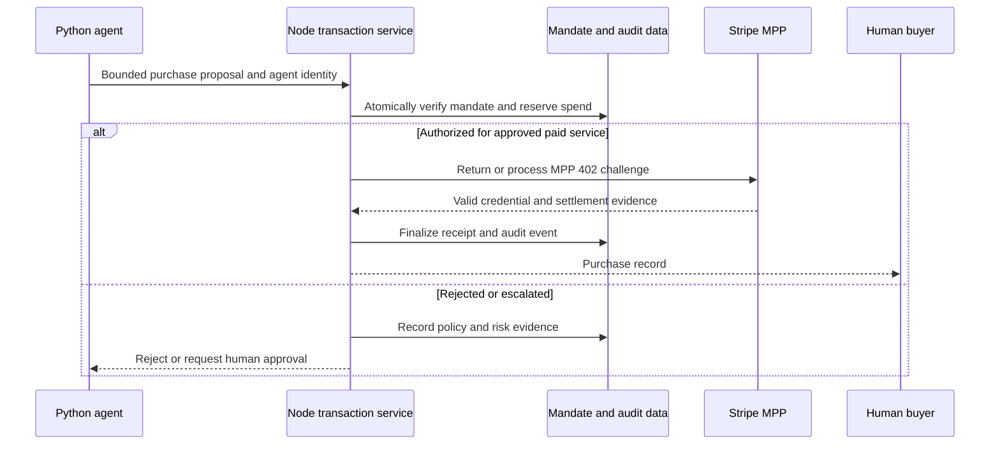

# Stripe MPP production runbook

## Status and decision boundary

This is a production-readiness plan for a future Track 01 validation. It is not a live integration, provider approval, or permission to make a real marketplace purchase.

**Decision:** keep Stripe MPP inside the Node.js transaction service. Python workers may research, score risk, or explain a recommendation. They must not hold Stripe keys, authenticate a payment, reserve spend, or decide whether a purchase is authorized.

Stripe MPP is a mechanism for an agent to pay for an API or service controlled by the server responding to it. The server returns an HTTP `402` challenge, receives a payment credential on retry, records a Stripe `PaymentIntent`, then releases the paid resource with a receipt.[^mpp] It is not a generic authorization to charge a buyer at an arbitrary external merchant. For Track 01, merchant settlement remains mocked until a separately approved provider arrangement exists.

## What "create the Stripe business API" means

There is no separate business API application to create. The sequence is:

1. Create a Stripe account and obtain sandbox API keys.
2. Complete the Dashboard account checklist and business verification.
3. Activate the relevant live Stripe service.
4. Create a Stripe business profile and retain its `profile_...` ID.
5. Use the server-side Stripe key and that profile ID to configure the MPP endpoint.[^setup][^mpp][^keys]

Sandbox development does not require live activation. Stripe creates sandbox keys at account sign-up, and sandbox and live mode have separate keys and separate objects.[^keys]

## Account creation checklist

Complete this in the Stripe Dashboard. The exact evidence Stripe requests is jurisdiction-, business-type-, and service-dependent, so the Dashboard is the final requirement list.[^setup]

### Information to have ready

| Area | Prepare | Why it matters |
| --- | --- | --- |
| Legal business | Legal name, business type, registered address, and the person authorized to represent it | Stripe verifies the business to activate live services |
| Product and operating model | Public site, clear description of the service being sold, and the relationship between the business and service | Stripe asks for business, product, and relationship information during verification |
| Customer-facing identity | Business name, website, support email, phone number, address, support site, and recognizable statement descriptor | Customers see this information on statements or Stripe email receipts |
| Payouts | Bank account details and selected payout schedule | Incorrect bank information can delay payouts |
| Team security | Named account owner and separately invited team members | Do not share the owner login or API keys |
| Compliance | Review of Stripe's restricted-business policy for the proposed service | Restricted businesses can require additional documentation; prohibited businesses cannot use Stripe |

### Required account hardening

Before accepting a live payment:

- Enable two-factor authentication. Stripe recommends a passkey or security key over SMS.[^account-checklist]
- Verify the business and complete every Dashboard activation prompt.[^setup]
- Review public business information and the statement descriptor. Stripe requires the descriptor to be recognizable to customers and its standard descriptor constraints include 5 to 22 characters.[^account-checklist]
- Verify bank details, payout schedule, charge notifications, and dispute notifications.[^account-checklist]
- Give people role-scoped Dashboard access instead of sharing credentials.[^account-checklist]
- Review the restricted-business policy before committing to Stripe.[^account-checklist]

## Time to account readiness

| Stage | Time status |
| --- | --- |
| Create account and access a sandbox | Available at sign-up for development. Stripe's documentation says a sandbox can be used after creating the account.[^setup] |
| Prepare and submit business information | [INFERENCE] Roughly 30 to 60 minutes when the information, site, representative, and bank details are already available. |
| Stripe live verification and service activation | Stripe does not publish a universal completion time in the official pages reviewed here. Verification can request additional information, so there is no safe deadline to promise.[^setup] |
| Stripe MPP endpoint build and sandbox validation | Depends on the team, but is independently testable before live activation with sandbox keys and `mppx validate`.[^mpp] |
| First live validation | Only after the account and required MPP payment methods are live. The live validator can transact with real funds.[^mpp] |

**Planning rule:** create the Stripe sandbox account immediately. Treat live verification as an external dependency, not a hackathon-critical path. The demo must remain complete with mocked merchant settlement if activation is delayed.

## MPP-specific prerequisites

1. Create a Stripe business profile in the Dashboard.
2. Record its `profile_...` ID as `STRIPE_PROFILE_ID`. Stripe MPP uses this as `networkId` in the endpoint configuration.[^mpp]
3. Confirm current availability for the intended account and payment method. Stripe points to a separate availability page for Shared Payment Tokens and stablecoins.[^mpp]
4. Install the documented Node server dependencies:

   ```bash
   npm install mppx stripe
   ```

5. Keep the Stripe server credential in the Node runtime's secrets store. Do not expose it to the browser, Python worker, or repository. Stripe recommends restricted API keys for new server-side use cases where their permissions are sufficient; its MPP sample uses a server-side Stripe credential.[^keys][^mpp]
6. Create a separate sandbox business profile and use its `profile_test_...` ID with sandbox keys.[^mpp]

### Payment methods

| Method | Stripe MPP behavior | Track 01 use |
| --- | --- | --- |
| Card through Shared Payment Tokens, or SPTs | Enabled by the basic endpoint. Stripe requires at least 0.50 USD, or equivalent, for SPT card payments.[^mpp] | Controlled proof that the server can settle payment for its own paid resource |
| Tempo stablecoin | Add a Stripe crypto deposit address for Tempo. Stripe documents charges as low as 0.01 USDC and automatic off-ramping to the Stripe balance.[^mpp] | Optional separate stablecoin proof. Do not call this a Stripe card credential or generic marketplace settlement |

Do not conflate these with the supplied Parallel research-payment options. A Parallel API payment can pay for research used by the agent. It is not evidence that an external merchant purchase settled.[^track01]

## Runtime architecture and authority boundary



The order is intentional:

1. Node reads the current mandate version, agent identity, scope, remaining limit, expiry, and revocation state.
2. In one conditional database transaction, Node creates an idempotent purchase attempt, reserves the permitted amount, and appends a pending audit event.
3. Only a successful reservation may reach the approved payment adapter or MPP service.
4. Node records the MPP receipt and `PaymentIntent` reference after the provider response, then finalizes the outcome.
5. A revocation or competing purchase that wins first makes the later request fail.

A Stripe receipt demonstrates payment for the MPP-protected resource. It does not replace the mandate, authorize a later payment, or excuse a failed policy check.

## Server configuration

Use separate sandbox and live environments. Never reuse a sandbox profile, receipt, or key in live mode.[^keys]

| Variable | Scope | Notes |
| --- | --- | --- |
| `STRIPE_SECRET_KEY` | Node server only | Sandbox `sk_test_...` or live `sk_live_...`, kept in a secrets store |
| `STRIPE_PROFILE_ID` | Node server only | Stripe business-profile `profile_...` ID used as MPP `networkId` |
| `TEMPO_DEPOSIT_ADDRESS` | Node server only, optional | Stripe-created Tempo deposit address when Tempo stablecoins are enabled |
| Stripe MPP challenge secret | Node server only | Derived or configured only inside the service. Never send it to clients |
| Stripe webhook signing secret | Node receiver only, if webhooks are configured | Separate from API keys and used to authenticate Stripe webhook delivery.[^keys] |

Create separate records for each environment:

- `payment_attempt_id`
- `mandate_id` and exact mandate version
- requesting `agent_identity_id`
- idempotency key
- reserved amount and currency
- payment method offered and used
- Stripe `PaymentIntent` ID when created
- MPP receipt reference
- final settlement status
- audit-event IDs for reservation, provider response, completion, refund, or failure

## Build and validate in stages

### 1. Local policy simulation

Prove that Node, not the agent, controls authorization:

- in-scope request reserves spend once;
- duplicate idempotency key cannot double-reserve;
- over-limit, expired, out-of-scope, impersonated, and revoked requests reject or escalate;
- a live revocation followed by a second attempt fails from current state;
- each outcome leaves auditable evidence.

Do not call Stripe in this stage.

### 2. Stripe sandbox endpoint

Create a sandbox business profile, configure `STRIPE_PROFILE_ID` with its `profile_test_...` value, and use sandbox keys.[^mpp]

The MPP endpoint must:

1. Return `402 Payment Required` with a signed challenge when no valid credential is present.
2. Verify a valid retry credential.
3. Record the payment with Stripe.
4. Return the paid resource and receipt only after successful processing.[^mpp]

Run Stripe's end-to-end validator:

```bash
npx mppx@latest validate https://sandbox.example.com/paid
```

The validator checks discovery, challenge format, error handling, and the payment round trip. Stripe says sandbox validation automatically performs test transactions.[^mpp]

### 3. Optional Tempo sandbox path

If stablecoins are in scope, create a sandbox Tempo crypto deposit address and configure it outside the core request path. Stripe says `defaultMethods()` can then offer SPT and Tempo methods, while `mppx.compose()` can set distinct amounts by method.[^mpp]

Validate the card and Tempo paths separately. They have different credentials and settlement rails.

### 4. Live readiness review

All of these must be true before a live test:

- Stripe has verified the business and activated the required service.
- MPP payment-method availability is confirmed for the account.[^mpp]
- Live secrets exist only in the Node service's production secret store.
- The service uses current mandate checks, atomic reservation, idempotency, and auditable state transitions.
- A separately reviewed Stripe or other provider contract covers the intended paid service and the planned settlement behavior.[^track01]
- Documented fraud controls cover the live payment flow and operational response.[^track01]
- Refund and dispute operations have a named human owner and a documented provider-specific workflow.
- The MPP endpoint serves a controlled paid service, not an unapproved external merchant checkout.
- A one-use, low-limit mandate names the operator and MPP-protected service only, has explicit buyer approval, and cannot authorize an external marketplace merchant.
- The team has explicitly approved the live-funds test.
- Operational alerting and reconciliation are in place for failed or duplicate attempts.

### 5. Deliberate live validation

Run a single low-value test only after the readiness review. Stripe warns that `mppx validate` in live mode can complete round-trip transactions with real funds.[^mpp]

Record the exact test mandate, amount, timestamp, MPP receipt, Stripe `PaymentIntent` ID, and the human reviewer who examined the result. Do not use a shared card, an unbounded mandate, or a production customer purchase as the first test.

## Operational controls

| Risk | Required control |
| --- | --- |
| Agent tries to spend without authority | Node validates the current mandate and agent identity before payment processing |
| Revoked mandate races a purchase | One conditional transaction reserves spend only while the mandate is active |
| Retry causes duplicate charge | Idempotency key and durable attempt record precede provider invocation |
| Prompt injection changes payment behavior | Product pages, seller text, and agent output are untrusted input, never authority |
| Server credential exposure | Secrets store, least privilege where compatible, access policy, rotation, and no client or worker exposure[^keys] |
| Provider event spoofing | Verify each Stripe webhook signature before using it for reconciliation[^keys] |
| Dispute or refund lacks evidence | Preserve the mandate version, policy result, request, receipt, payment reference, and final human decision |

## Explicit non-goals

This runbook does not authorize:

- storing or handling raw card data;
- direct access to a buyer's passkey private material;
- direct Stripe access from the Python worker or browser;
- automatic refunds without a provider-specific policy and reviewed operation;
- a real external marketplace purchase;
- describing card, Tempo, x402, and Parallel research payment flows as one interchangeable protocol.

## Sources and evidence boundary

The Stripe facts in this document were checked against Stripe documentation on 29 August 2026. Timelines marked `[INFERENCE]` are planning estimates, not Stripe service-level commitments.

[^track01]: [Track 01 product direction](./track-01-product-direction.md)
[^setup]: [Stripe: Set up your account](https://docs.stripe.com/get-started/account/set-up)
[^account-checklist]: [Stripe: Account checklist](https://docs.stripe.com/get-started/account/checklist)
[^keys]: [Stripe: API keys](https://docs.stripe.com/keys)
[^mpp]: [Stripe: MPP](https://docs.stripe.com/payments/machine/mpp)
