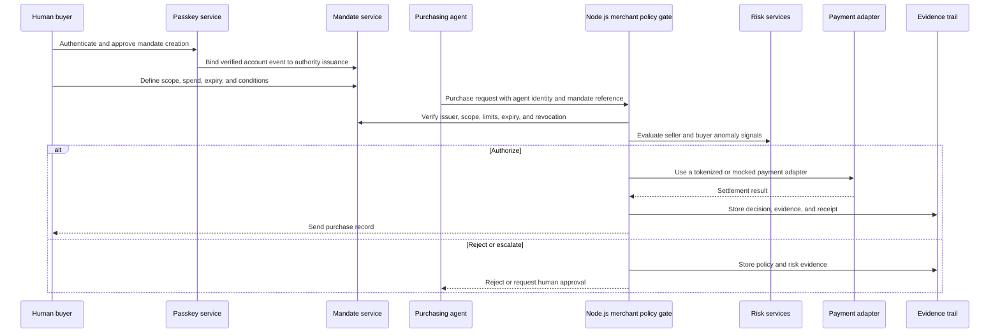
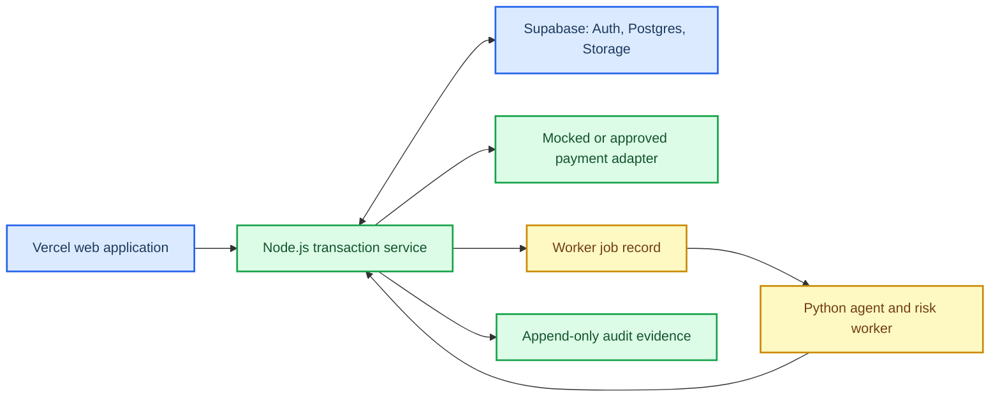

# Track 01 product direction: governed agent marketplace

## Status and decision boundary

**Current team direction:** pursue Challenge 01, **The Buyer Who Isn't Human**.

This is a working product direction, not a final hackathon registration or proof that a product exists. The crew must still make the single final challenge choice required by the hackathon. The brief permits mocked catalogs, prices, protocols, and payment methods, so the first demo should optimize for verifiable authorization behavior rather than unproven payment integrations.[^challenge01]

The thesis is an intelligent agent marketplace, inspired by the breadth of a Mercado Livre-style catalog but designed to buy from external merchants as well. Mercado Livre is a product reference only. This document does not claim a partnership, integration, brand use, catalog access, or permission to purchase there.

## Product thesis

An agent should be able to research products, decide within explicit constraints, and request a purchase. A merchant should be able to verify that the agent represents a real authorized buyer without receiving the buyer's raw card number. The buyer should be able to understand, revoke, dispute, and refund that purchase later.

The product is not a shopping chatbot. It is a **governed purchase authority layer** that sits between buyer, agent, merchant, payment method, and audit trail.

The hard question to make visible in the demo is:

> What evidence lets a merchant accept an agent purchase while preserving the human buyer's control and making abuse diagnosable?

## Challenge 01 contract

The product must preserve the complete Track 01 flow:

1. The human creates a mandate that specifies item scope, maximum spend, expiry, and payment method.
2. The agent performs discovery and makes a purchase request, but never receives a raw card.
3. The merchant verifies agent identity, the mandate, current limits, and revocation state at decision time.
4. The merchant accepts, rejects, or escalates the request.
5. The human receives a purchase record.
6. Human, merchant, and auditor views expose the same decision trail at their appropriate level of detail.
7. A revoked, expired, impersonated, or out-of-scope request fails or escalates without team intervention.[^challenge01]

The trial by fire is a live policy change followed by another purchase attempt. A static authorization screenshot is not enough.[^challenge01]

## Product model

The merchant policy gate in this diagram is a logical role implemented by the Node.js transaction service. It is the merchant-side enforcement point, not an independent agent or payment process.

### Authority is not a single credential

The team notes propose crossing passkey and payment credentials. That should become a deliberate separation of responsibilities:

| Element | What it proves or controls | What the agent receives |
| --- | --- | --- |
| Passkey event | The buyer authenticated or approved an account action on an approved device | No private key or reusable passkey secret |
| Mandate | Scope, spend limit, expiry, payment-method permission, and revocation status | A reference or signed, limited capability |
| Agent identity | Which agent instance made the request | Its own non-human identity credential |
| Payment credential | Ability to initiate the permitted settlement path | Never a raw card number |
| Merchant policy result | Whether this specific request is currently permitted | Allow, reject, or escalate outcome |

A passkey should authenticate the buyer's account action. It should not be represented as proof that a merchant has independently verified a specific biometric. Local biometric or device verification is platform behavior; the server should rely on the resulting authenticated account event and the current mandate.

The language model must not hold a raw card, a reusable passkey private key, or unrestricted payment authority. The security boundary is server-side policy evaluation against current state.

### Buyer passkey and agent signing identity

Do not give an autonomous agent a user's WebAuthn passkey. A passkey private key is bound to its authenticator and should remain unavailable to the application, the agent, and the server. A user passkey proves that the buyer authenticated or approved a mandate action. It cannot prove that an autonomous agent made a later purchase.

Use a second, non-human cryptographic identity for every agent:

1. The buyer uses a passkey to create, change, or revoke a scoped mandate.
2. Node provisions an agent identity and an Ed25519 signing key held by the server's KMS or HSM. The private key never enters the model context, browser, worker filesystem, database, logs, or chat.
3. The agent requests a purchase through its constrained tool. The service signs a short-lived proof that commits to the agent identity, key ID, mandate ID and version, HTTP method and path, request-body hash, nonce, issued time, and expiry.
4. Node verifies the proof against the stored public key, atomically records and consumes the nonce, then checks the current mandate before it reserves payment.
5. The receipt and audit trail name the agent identity, signing-key ID, proof ID, mandate version, and verified timestamp.

This distinguishes technical actor from buyer: the buyer cannot generate the agent proof, and a user-originated request cannot be relabeled as agent-originated. It does not prove that a buyer never instructed the agent. It proves which controlled credential submitted the recorded action.

The implemented schema uses `server_kms` custody for agent keys. A dedicated WebAuthn authenticator could be used only when the agent has exclusive control of that authenticator and its user-verification policy is compatible with autonomous operation. That is not the default for a server-hosted purchasing agent.

## Payment and research rails

The supplied Parallel reference describes three distinct payment options for **Parallel's paid research APIs**. They must not be collapsed into a claim that one credential or protocol supports every marketplace purchase:

| Option in the Parallel reference | Documented use | What it does not establish for this product |
| --- | --- | --- |
| MPP with Stripe | A credit card can pay the Parallel MPP gateway | Generic merchant checkout or USDC settlement |
| MPP with Tempo | `pathUSD` or USDC can pay the Parallel MPP gateway on Tempo | A Stripe-backed USDC purchase credential |
| x402 with Base USDC | `purl` can pay the Parallel MPP gateway through x402 on Base | A general external-marketplace payment integration |

Parallel documents an HTTP `402` challenge, payment credential, and retry flow for its Search, Extract, and Task APIs. Its MPP gateway can support agent research before a purchase decision. That is useful as an evidence-gathering service, but it is separate from merchant-side purchase authorization.[^parallel]

### Proposed hackathon payment stance

- **Marketplace checkout:** mock the catalog and settlement adapter first. This is explicitly allowed by Track 01 and keeps the demo focused on authorization, revocation, and auditability.[^challenge01]
- **Agent research:** optionally use the Parallel MPP or x402 path to acquire paid research data when that materially improves a purchase decision. Record that cost as agent activity, not as proof that a merchant purchase settled.
- **Real money:** a later validation decision, not a demo assumption. Do not enable real funds, real card data, or a real external merchant purchase without a separately reviewed provider contract, fraud controls, refund path, and explicit team approval.
- **Protocol selection:** validate MPP with Stripe, MPP with Tempo stablecoins, and x402 with Base USDC as separate candidates. The supplied source does not support describing this as one "MPP da Stripe in USDC" flow.[^parallel]

### Python and Stripe MPP boundary

MPP has an official Python SDK, `pympp`, and its documented Python examples use the Tempo payment method. The current Stripe MPP guide documents a Node.js server integration using `mppx` and `stripe`.[^mpppython][^stripempp]

**Decision:** keep Stripe MPP in the Node.js transaction service. Python agents can perform research, risk analysis, and recommendations, then call the internal Node service with a bounded result. The reviewed documentation does not establish a supported direct Python integration for the Stripe MPP payment method, so the team should not design the checkout around one.

## Proposed technical stack

This is the proposed implementation split. It is intentionally arranged so that agent reasoning cannot become the payment or authorization authority.

| Layer | Technology | Responsibility | Hard boundary |
| --- | --- | --- | --- |
| Web application | Vercel | Buyer, merchant, and auditor views; passkey interaction; deployment of the web surface | Browser code never receives a raw card, provider secret, Supabase secret key, or unrestricted mandate mutation capability |
| Transaction service | Node.js | Mandate creation and verification, current-state policy checks, payment-adapter calls, idempotency, audit-event append, and worker-job creation | This is the only component that can authorize a purchase, change mandate state, or invoke a payment adapter |
| Application data | Supabase | Postgres records for users, mandates, agent identities, purchase attempts, risk evidence, refund cases, and audit events; Auth and protected storage where needed | Row Level Security protects user-facing data; any Supabase secret or service-role key stays server-side because it bypasses RLS[^supabase] |
| Agent and risk worker | Python | Product research, proposal generation, anomaly scoring, agent-judge explanations, and refund evidence summaries | It can recommend an action but cannot settle a payment, revoke a mandate, or write an authorization outcome directly |

### Runtime rules

- **Vercel:** host the web application and short request handlers. A checkout request must receive a bounded response. It must not wait for an unbounded agent loop or depend on in-memory request state across invocations.[^vercel]
- **Node.js:** own the synchronous purchase decision. In one conditional database transaction, it verifies the active mandate ID and version, revocation state, agent identity, scope, remaining limit, and idempotency key; reserves permitted spend; and appends a pending decision record. Only a successful reservation may reach a mocked or approved payment adapter. A revocation or competing purchase that wins first makes the later attempt fail. Node records settlement evidence and final outcome after the adapter response.
- **Supabase:** store state that must outlive a request. Use explicit RLS policies for browser-accessible data. Keep Supabase secret or service-role keys in server environments only because those keys bypass RLS.[^supabase]
- **Python:** run asynchronously after Node creates a bounded job record. It returns a signed, schema-validated result to an internal Node endpoint. Node validates and persists that result against current policy state. Python has no direct write route to mandates, purchase attempts, authorization outcomes, payment records, or audit events.
- **Payment and passkey material:** Node holds only the references or provider tokens it actually needs. The browser and Python worker never receive raw cards, reusable passkey private material, or a privileged Supabase key.

### First data model

| Record | Minimum fields | Writer |
| --- | --- | --- |
| `mandates` | mandate ID, version, buyer ID, agent ID, scope, limits, expiry, payment-method reference, status, passkey approval-event reference | Node.js after buyer approval |
| `purchase_attempts` | attempt ID, mandate ID and version, requesting agent-identity evidence reference, merchant, items, amount, reservation status, policy result, idempotency key, settlement status, adapter reference, receipt-evidence reference | Node.js |
| `risk_assessments` | assessment ID, attempt ID or mandate ID, subject, signals, score, agent-judge explanation, model or rules version | Python returns a signed result; Node.js validates and records |
| `audit_events` | event ID, mandate ID, purchase-attempt ID when applicable, timestamp, actor, event type, evidence references, prior event hash or version | Node.js append only |
| `refund_cases` | refund-case ID, purchase-attempt ID, reason, eligibility result, recommendation, settlement evidence reference, final actor and outcome | Node.js records after policy review |
| `worker_jobs` | job ID, type, input reference, status, retry count, result reference | Node.js creates and updates after receiving a signed Python result |

The user-facing views must be projections of these records. They must not become a second source of truth for mandate or payment state.

## Policy, guidelines, and attack resistance

Guidelines can help the agent interpret the buyer's intent. They cannot independently create spending authority.

| Decision layer | Source of authority | Required behavior |
| --- | --- | --- |
| Deterministic policy gate | Current signed mandate, merchant policy, revocation state, payment capability | Final allow, reject, or escalation decision |
| Agent planner | Buyer preferences and retrieved product information | Propose purchases and explain the reasoning, never widen authority |
| Agent judge | Guidelines, risk evidence, and audit history | Produce a review recommendation and reasons, never mint approval or bypass policy |
| Human buyer | Passkey-backed account action and explicit approval | Create, change, revoke, or approve authority |

Product listings, seller messages, product reviews, external webpages, and tool output are untrusted inputs. They may contain prompt injection or misleading instructions. They cannot alter a mandate, disable a policy check, reveal secrets, or cause payment. The agent should extract factual candidates from those sources, while the policy gate treats authority only as structured data from trusted services.

### Threat model

| STRIDE category | Relevant threat | Required control and demo proof |
| --- | --- | --- |
| Spoofing | A malicious agent claims to represent the buyer | Verify the agent identity and bind the request to a current mandate |
| Tampering | A request changes price, product, mandate reference, or audit event | Sign or integrity-protect mandate and decision records; display the evidence used |
| Repudiation | Buyer or merchant later disputes authorization | Preserve time, request, policy result, approval history, and receipt in the audit trail |
| Information disclosure | The agent or merchant receives raw payment data unnecessarily | Keep raw card data outside the agent and minimize each view to its role |
| Denial of service | A seller or agent floods verification or refund requests | Rate-limit and queue requests; retain an operator escalation path |
| Elevation of privilege | Prompt injection or a compromised agent widens its own purchase scope | Evaluate scope, limits, expiry, and revocation on the server for every attempt |

## Seller and buyer anomaly detection

The product needs risk signals on both sides. An anomaly score is not itself permission to charge a buyer. It is evidence that can tighten policy, reject the request, or route it to human review.

| Domain | Example signals | Possible result |
| --- | --- | --- |
| Seller risk | New or inconsistent merchant identity, price outlier, abrupt payout destination change, repeated disputes, suspicious fulfillment evidence | Reject, require stronger evidence, or escalate |
| Buyer and agent risk | Spending velocity, unusually high basket, unfamiliar product category, repeated near-limit attempts, agent identity mismatch, request after revocation | Reject, request approval, or constrain the mandate |
| Request-content risk | Prompt injection text, conflict between listing and mandate, hidden instruction to bypass review | Ignore untrusted instruction, preserve evidence, and escalate if material |

The agent judge can summarize why a case looks anomalous and recommend an action. The deterministic policy gate must make the final authorization decision. This prevents a persuasive model output from becoming a payment bypass.

## Intelligent refund and dispute path

A refund system should reuse the original purchase evidence rather than guessing from a chat transcript.

1. The buyer requests a refund or disputes a charge.
2. The system retrieves the mandate version, agent identity, merchant verification result, anomaly evidence, receipt, and purchase record.
3. A rules layer checks eligibility, time window, settlement status, and whether the original purchase was inside scope.
4. The agent judge summarizes the evidence and recommends automatic refund, merchant review, or human escalation.
5. The final result, rationale, and actor are appended to the audit trail.

For the hackathon, one simulated dispute is enough if it can answer the question in the brief: was the purchase actually authorized?[^challenge01]

## What to build first

### Minimum credible prototype

1. A buyer creates a scoped mandate with an expiry, a spending limit, a permitted category, and a tokenized or mocked payment-method reference.
2. A named agent discovers a product in a mocked marketplace and proposes one purchase.
3. The merchant policy gate verifies agent identity, scope, limit, expiry, payment-method permission, and current revocation state.
4. The system completes an in-scope mocked purchase, sends the buyer record, and populates human, merchant, and auditor views.
5. The team demonstrates an over-limit or forbidden-category request that is rejected or escalated.
6. The judge revokes the mandate live, then repeats the purchase attempt. The second attempt fails from current state.

### Evidence worth adding after the core works

- One adversarial seller or product-listing prompt-injection attempt.
- One buyer or agent anomaly that produces escalation rather than silent approval.
- One dispute or refund decision reconstructed from the audit trail.
- One paid Parallel research request with a recorded `402` payment and response, clearly labeled as a research-service cost rather than marketplace settlement.
- Conditional approval for rich terms such as a price threshold or monthly frequency limit.

### Do not spend hackathon time on this first

- A real Mercado Livre integration.
- Direct external-store checkout.
- Handling raw card data.
- Real-money settlement.
- A broad catalog, recommendation engine, or many merchants before the revocation and evidence path is reliable.

## Why Track 01 fits better than the alternatives

| Track | Useful idea retained | Why it is not the primary challenge |
| --- | --- | --- |
| 01: Buyer Who Isn't Human | Mandated purchase authority, payment boundaries, merchant verification, dispute evidence | Directly matches the intended marketplace and agent-payment product |
| 02: Control Tower | Seller and buyer anomaly detection can become a future risk-control module | Its central problem is payment-incident diagnosis, not delegated purchasing authority |
| 03: Interface That Builds Itself | Separate human, merchant, and auditor views can be adaptive later | Its runtime-interface trial would divert the first build away from the authorization and payment thesis |
| 04: Agent on the Line | A later agent could negotiate complex purchases or service cases | Reliable voice calls, parallel negotiations, and live escalation are too far from the current product core to do well under hackathon constraints |

## Open decisions before implementation

| Decision | Current position | Evidence needed to close it |
| --- | --- | --- |
| Final track registration | Leaning to Track 01 | Team confirms a single final choice |
| Marketplace surface | Mock catalog with optional external-product links | Decide whether any external merchant has documented permission and a safe sandbox |
| Payment demo | Mock merchant settlement plus optional paid research call | Verify exact provider account, network, credentials, and refund capabilities before a real-money proposal |
| Passkey policy | Passkey-backed buyer account approval; agent never receives passkey private material | Decide supported devices, recovery path, and whether user verification is mandatory |
| Mandate format | Structured, versioned, revocable capability | Define issuer, audience, key rotation, storage, and replay protection |
| Technical stack | Vercel web application, Node.js transaction service, Supabase state boundary, Python agent and risk worker | Confirm hosting, worker runtime, secrets boundary, and schema before implementation |
| Risk control | Deterministic rules first; agent judge only recommends | Define escalation thresholds and the human review owner |
| Refund behavior | Simulated, evidence-backed decision path | Define provider-specific settlement and refund operations only after a provider is selected |

## Sources and evidence boundary

- The hackathon-specific requirements in this document come from the supplied Challenge 01 brief.[^challenge01]
- Claims about Parallel MPP, Stripe, Tempo stablecoins, x402, and supported Parallel API payment flows come from the supplied Parallel documentation, accessed on 29 August 2026.[^parallel]
- Claims about the proposed Vercel and Supabase boundaries are based on their current documentation: Vercel isolates serverless execution and exposes secrets through server environment variables; Supabase secret or service-role keys bypass RLS and must remain server-side.[^vercel][^supabase]
- Claims about Python MPP and Stripe MPP runtime support are limited to their current official guides: `pympp` documents Tempo examples in Python, while Stripe's MPP server guide documents Node.js with `mppx` and `stripe`.[^mpppython][^stripempp]
- Statements marked **proposed**, **optional**, **current position**, or **open decision** are team design choices. They are not provider commitments, live integrations, or security certifications.

[^challenge01]: [Challenge 01: The Buyer Who Isn't Human](./challenge-01-buyer-who-isnt-human.md)
[^parallel]: [Parallel: Agentic Payments (MPP & x402)](https://docs.parallel.ai/integrations/agentic-payments)
[^vercel]: [Vercel documentation](https://vercel.com/docs)
[^supabase]: [Supabase: Securing data](https://supabase.com/docs/guides/database/secure-data)
[^mpppython]: [MPP Python SDK](https://mpp.dev/sdk/python/)
[^stripempp]: [Stripe: MPP](https://docs.stripe.com/payments/machine/mpp)
