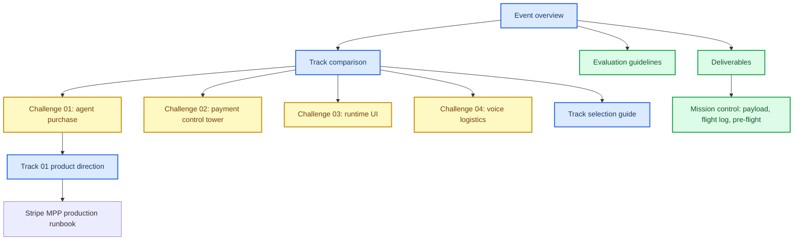

# NextWave Hackathon 2026

_Reference material for the Yuno × Nauta hackathon brief, judging criteria, and submission readiness._

---

## Navigation

| Document | Purpose |
| --- | --- |
| [Hackathon overview](./hackathon-overview.md) | Event rules, timing, and operating constraints |
| [Tracks](./tracks.md) | Side-by-side map of the four selectable challenges |
| [Track selection guide](./track-selection-guide.md) | Adversarial team-fit analysis, including why Challenges 01 and 03 can beat a higher-spectacle Track 04 |
| [Yuno and Nauta context](./yuno-nauta-context.md) | Company domains, reported event partnership, track classification, evidence limits, and sources |
| [Challenge 01: The Buyer Who Isn't Human](./challenge-01-buyer-who-isnt-human.md) | Agent purchase mandates and merchant verification |
| [Track 01 product direction](../api/docs/track-01-product-direction.md) | Team proposal for a governed agent marketplace, authorization, payment research, risks, and build order |
| [Stripe MPP production runbook](../api/docs/stripe-mpp-production-runbook.md) | Stripe account readiness, MPP validation stages, payment boundaries, and live-funds controls |
| [Challenge 02: The Control Tower](./challenge-02-control-tower.md) | Payment conversion monitoring and root-cause diagnosis |
| [Challenge 03: The Interface That Builds Itself](./challenge-03-interface-that-builds-itself.md) | Runtime-generated workflow UI |
| [Challenge 04: The Agent on the Line](./challenge-04-agent-on-the-line.md) | Voice logistics negotiation and commitments |
| [Evaluation guidelines](./evaluation-guidelines.md) | Jury lenses, judging format, and scoring principles |
| [Deliverables](./deliverables.md) | Required submission artifacts and their acceptance criteria |
| [Mission control](./mission-control.md) | Payload fields, flight log, and pre-flight checklist |
| [Decision log](./decision-log.md) | Flight-log template for real technical trade-offs |

## Source boundary

These files reorganize the NextWave Hackathon 2026 material supplied for this repository. They record the brief and readiness requirements. The track selection guide contains a team-facing recommendation, not an official track assignment or a claim that a product has been built. The Track 01 product direction records a current team proposal and evidence boundaries, not final registration or a live integration. The Stripe MPP production runbook is a future production-readiness plan, not a live-provider approval or authorization to process external marketplace purchases.

## Documentation map

