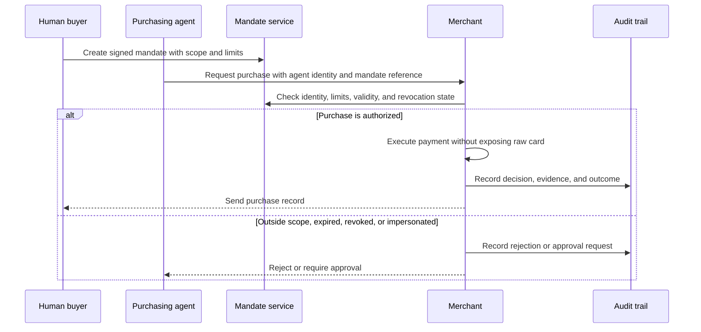

# Challenge 01: The Buyer Who Isn't Human

_A safe purchase flow for merchants, human buyers, and purchasing agents._

---

## Problem

Payment systems assume the person pressing "pay" is the buyer. That breaks when an AI system finds, decides, and buys on behalf of a person or company. Merchants need to tell a legitimate, authorized agent from fraud without blocking valid sales or treating bots as people.

The missing control is a mandate. It is a verifiable authorization from a human that says what an agent may buy, how much it may spend, when it expires, and which payment method it can use.

## Domain definitions

| Term | Meaning |
| --- | --- |
| Merchant | Company collecting payment |
| Purchasing agent | AI system that discovers, decides, and buys for a person or company |
| Mandate | Verifiable human authorization that defines item scope, limits, validity, and payment method |
| Verification | Merchant check that the agent has a valid mandate from a real human and is operating within it |
| Revocation | Human withdrawal of a mandate. Every later purchase must fail |
| Chargeback / dispute | Cardholder denial of a payment, followed by a bank reversal |
| Human-in-the-loop | Point where the agent must stop and obtain human approval |

## Objective

Build a complete agent-purchase flow that:

- Lets a human create a mandate with item scope, spending limit, expiry, and permitted payment method without handing the agent the raw card
- Lets the merchant verify the agent identity, mandate validity, and purchase scope before accepting payment
- Runs discovery, decision, payment, and human notification from start to finish
- Handles out-of-mandate purchases, expiry, live revocation, impersonation, and later disputes
- Keeps a decision trail that the human, merchant, and auditor can read

Possible extensions include escalation outside a mandate, category or recurring mandates, and an agent identity distinct from the human identity.

## Required flow

## Expected demo

The demo must show:

- A human creates a mandate and their agent completes a purchase within it. Catalog, prices, mandates, protocols, and payment methods may be mocked
- A purchase outside the mandate, such as an exceeded amount, forbidden category, or expired mandate, is rejected or escalated. It must not be silently approved
- Live revocation: after revocation, the next purchase fails
- Separate views for the human record, merchant verification, and the auditor’s full trail
- A passing trial by fire

### Bonus points

- A dispute flow where the audit trail can determine whether a denied purchase was authorized
- Rich conditions evaluated correctly, such as "if it drops below $150" or "up to three times a month"
- Defenses against an adversarial agent that tries creative paths outside its mandate

## Minimal fictional case

**Merchant:** VuelaYa, an online travel agency that wants to accept agentic purchases without inviting fraud.

**Buyer:** Marta authorizes her personal agent to "buy me a flight to Córdoba if it drops below $150, valid until the end of the month."

| Moment | Required behavior |
| --- | --- |
| Mandate creation | Marta sets the destination, price condition, validity, and payment authority |
| Valid purchase | A $130 flight appears. The agent buys it, Marta receives the record, and VuelaYa sees verification evidence |
| Invalid purchase | The agent attempts a $300 flight. The system rejects it or requests human approval |
| Revocation | Marta revokes the mandate. The next agent attempt fails |

## Trial by fire

Judges may revoke a mandate or change a limit live, then make another agent purchase attempt. The system must use the current mandate state and react without team intervention.

## Technical defense

Be ready to explain how the system keeps the raw card out of the agent, binds agent authority to a person, checks revocation at the time of decision, records dispute evidence, and rejects requests outside the mandate.
