# Challenge 02: The Control Tower

_A monitoring and diagnosis system for payment conversion incidents in an orchestration platform._

---

## Problem

Payment conversion can drop because of provider degradation, issuing-bank behavior, method outages, country-specific failures, or unannounced changes. An operations team needs more than an alert. It needs a supported root cause, affected scope, onset time, estimated money loss, confidence, and a recommendation for a human to act on.

Classic alerts either fire constantly or miss incidents until someone checks a dashboard. Diagnosis is harder because the signal appears in intersections of transaction dimensions.

## Domain definitions

| Term | Meaning |
| --- | --- |
| Merchant | Company collecting payments through the platform |
| Provider | External processor such as Stripe, Adyen, dLocal, or MercadoPago |
| Payment method | Card, PSE, wallet, PIX, cash-in-store, or similar method |
| Conversion / approval rate | Approved payments divided by attempted payments |
| Issuing bank | Buyer’s card issuer, which can independently decline a payment |
| Decline code | Reason a provider returns for a non-approved transaction |
| Transaction dimensions | Merchant × provider × method × country × issuing bank × decline code |
| Root cause | Specific origin of the problem, not just a symptom. For example, provider X declines bank Y cards in Brazil from 14:03 |

## Objective

Build a system that:

- Watches a live transaction stream and finds meaningful conversion drops while accounting for time of day, weekends, and statistical variance
- Searches transaction dimensions to isolate the root cause
- Explains what dropped, since when, who is affected, estimated cost, and the evidence for the diagnosis in language an operations person can use
- Prioritizes multiple incidents and says when evidence is not enough
- Recommends a human action without applying a remedy itself

## Diagnosis path

```mermaid
flowchart LR
    accTitle: Payment incident detection and diagnosis
    accDescr: Live transactions are compared with expected behavior. Anomalous slices are investigated across payment dimensions and reported with evidence and a recommended human action.

    stream["Live transaction stream"] --> baseline["Expected conversion baseline"]
    baseline --> detector["Significant drop detector"]
    detector -->|"normal noise"| observe["Continue observing"]
    detector -->|"meaningful drop"| slices["Dimension slicing"]
    slices --> evidence["Evidence and confidence"]
    evidence -->|"sufficient"| incident["Ranked incident: scope, onset, cost, cause"]
    evidence -->|"insufficient"| uncertain["Report uncertainty and next evidence needed"]
    incident --> action["Recommend human action"]

    classDef input fill:#dbeafe,stroke:#2563eb,stroke-width:2px,color:#1e3a5f
    classDef analysis fill:#fef9c3,stroke:#ca8a04,stroke-width:2px,color:#713f12
    classDef output fill:#dcfce7,stroke:#16a34a,stroke-width:2px,color:#14532d

    class stream,baseline input
    class detector,slices,evidence analysis
    class observe,incident,uncertain,action output
```

## Expected demo

The demo must show:

- A mocked transaction stream operating normally without firing on ordinary noise
- A live injected conversion drop detected in reasonable time
- The correct root-cause diagnosis with visible evidence: what, where, when it began, and who is affected
- A readable explanation, estimated cost, and recommended action
- Two simultaneous incidents separated and prioritized
- A passing trial by fire

### Bonus points

- A case where the system says evidence is insufficient
- Recognition of a repeat incident, such as one that happened on Tuesday
- Explanations for two audiences: detailed operations evidence and a one-line executive money summary

## Minimal fictional case

**Scenario:** PagoTotal is an orchestrator processing payments for three merchants through three providers in Mexico, Colombia, and Brazil. Teams may invent data volumes, transaction records, decline codes, dashboards, and history. The data model should remain extensible.

| Moment | Required behavior |
| --- | --- |
| Normal operation | The system watches the stream without alerting on ordinary variation |
| Provider incident | A provider starts over-declining only in Brazil. The system detects and diagnoses this pattern |
| Bank incident | At the same time, a Mexican issuing bank fails for one merchant. The system separates this from the provider incident and prioritizes both |
| Judge injection | A judge introduces a previously unrehearsed dimension combination. The system detects and diagnoses it live |

## Trial by fire

Judges inject an incident in a new combination of merchant, provider, method, country, issuing bank, or decline code. The system must identify the relevant slice and evidence without team operation.

## Technical defense

Be ready to explain the expected-behavior baseline, signal threshold or statistical rationale, dimension search method, why the proposed root cause is supported rather than just correlated, how simultaneous incidents are separated, and why recommendations stay human-executed.
