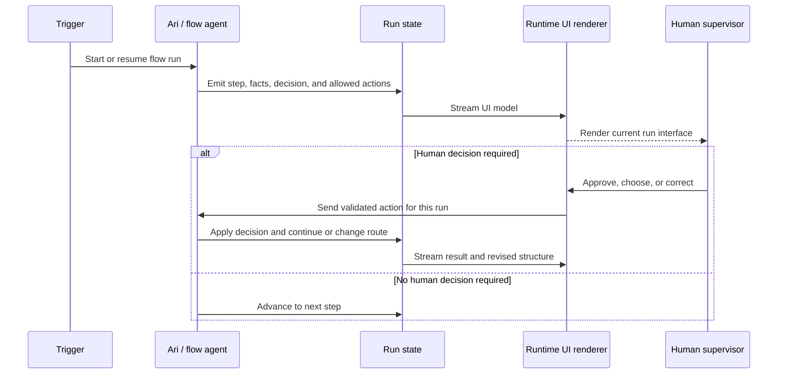

# Challenge 03: The Interface That Builds Itself

_A runtime-generated interface for supervising AI logistics workflows._

---

## Problem

AI logistics agents read documents and emails, track containers, detect exceptions, and take actions. Their supervisors still depend on fixed screens. An unexpected case may have no screen at all, a new flow requires frontend work, and decisions happen without the relevant context. That slows work and makes people less willing to trust the automation.

This challenge asks for an interface created from the workflow’s state and decisions. It must change while a run is active. A human choice in that generated UI must affect the agent’s next action during the same run.

## Logistics definitions

| Term | Meaning |
| --- | --- |
| Client | Importer or exporter using the platform |
| Logistics operation | Shipment grouping purchase orders, containers, and documents |
| Booking | Carrier-confirmed reservation of vessel space for containers |
| Container | Physical unit tracked from origin to destination |
| ETD / ETA | Estimated time of departure / arrival |
| Container states | Booking confirmed → in transit → arrived at port → customs → delivered |
| Purchase Order | Client order to its supplier |
| Booking Confirmation | Carrier confirmation of vessel, route, and dates |
| Bill of Lading | Transport contract that identifies the shipment |
| Invoice / Packing List | Commercial invoice and cargo detail |
| Arrival Notice | Notice of arrival at the destination port |

## Agent definitions

| Term | Meaning |
| --- | --- |
| Agent | AI system that executes work with tools, not only a chat interface |
| Flow / workflow | Sequence of steps and decisions executed after a trigger |
| Trigger | Event that starts a flow, such as an email arrival, ETA change, or scheduled time |
| Run | One execution of a flow. The same flow can run repeatedly |
| Human-in-the-loop | Point where a human must review, approve, or decide |

## Objective

Build a system where an agent executing a flow generates and renders its own interface in real time:

- The UI comes from flow state and agent decisions, not fixed screens
- The UI restructures step by step while a run advances. It streams while the agent works rather than refreshing after the run ends
- Each new run can change the interface
- A flow change results in a corresponding UI change
- A human action in the generated UI returns to the agent during the same run, changes its course, and renders the result immediately

## Runtime loop

## Expected demo

The prototype must show:

- An agent executing a flow with visible decisions
- A runtime-generated UI that reflects flow state
- The UI restructuring during a run as the agent progresses
- Successive runs updating the interface
- A human-in-the-loop action handled in the generated UI, with the agent visibly changing course and the UI showing the result
- A changed flow producing an adapted interface without manual frontend work

### Bonus points

- A coherent design system rather than a collage
- Several flows running at once, each with its own interface
- Explicit security rules for what an agent-generated UI may and may not do

## Minimal fictional case

**Company:** Muebles del Sur, importing furniture from Vietnam to Mexico.

**Agent:** Ari, which manages bookings and monitors shipments.

**Base flow:** An email with a Booking Confirmation arrives. Ari extracts the carrier, vessel, origin and destination ports, ETD, ETA, and containers. Ari creates the operation and monitors the voyage on each run. A serious problem requires a human decision through the same interface.

| Run | Flow state | Required UI behavior |
| --- | --- | --- |
| 1 | Booking confirmed | Create a route map from Vietnam to Mexico, a booking card, and a container list |
| 2 | Vessel departs | Update the map with vessel position and mark containers in transit |
| 3 | Unexpected transshipment and a nine-day ETA slip | Redraw the route and create a decision panel: wait, seek an alternative, or notify the end client |
| Trial | Add a step to validate the Bill of Lading against the booking before confirmation | Show the added validation step automatically |

## Trial by fire

Judges modify the flow live, for example by adding Bill-of-Lading validation or changing a decision. The interface must present the new work without a manually built replacement screen.

## Technical defense

Be ready to explain the UI representation emitted by the agent, renderer capability limits, how state updates a live run, how human actions are validated and tied to the run, and how a changed workflow produces a changed interface without arbitrary code generation.
