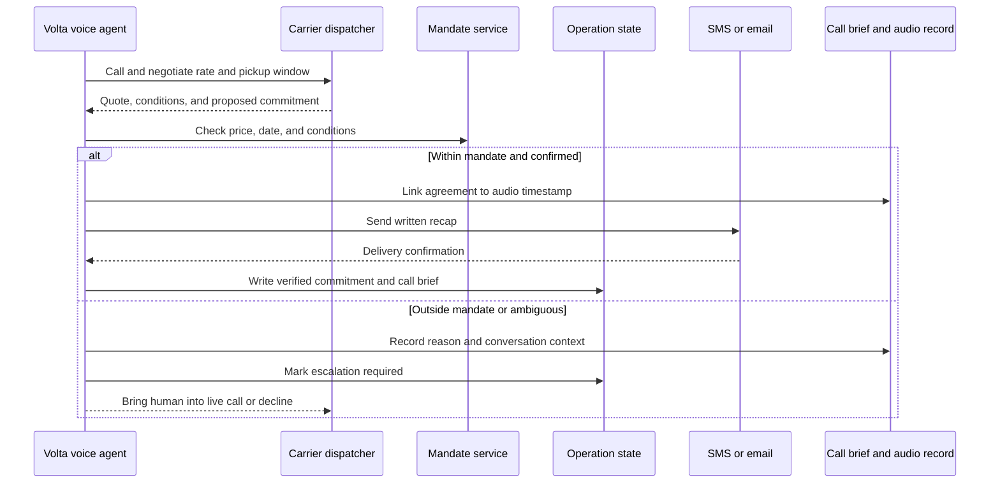

# Challenge 04: The Agent on the Line

_A voice agent that runs the drayage leg of a shipment through real telephone calls._

---

## Problem

Much of logistics still happens on the phone. People quote a truck, confirm pickup, chase drivers, and renegotiate delivery windows through calls. The calls leave little structured record, require both people to be available at the same time, and do not scale when many shipments have a problem.

A text-only agent cannot handle this part of the process. This challenge asks for a voice agent that can call, listen, negotiate within a mandate, turn a messy conversation into a commitment, and update the systems behind the operation.

## Domain definitions

| Term | Meaning |
| --- | --- |
| Voice agent | AI system that conducts a real-time spoken conversation, handles interruptions, and uses tools during a call |
| Drayage | Truck leg that moves a container from the port to the client warehouse |
| Carrier / dispatcher | Trucking company and the person who answers the phone, quotes rates, and assigns trucks |
| Commitment | Verifiable fact taken from a conversation, such as "pickup Thursday 10:00, $8,500 MXN, driver Juan" |
| Mandate | Human authorization that defines price cap, time window, and conditions the agent may agree to |
| Escalation | Hand-off to a human during a call, without hanging up or losing the context already gathered |
| Barge-in | Caller interrupts the agent while it is speaking |

The logistics vocabulary from Challenge 03 also applies: operation, booking, container, ETD, and ETA.

## Objective

Build a voice agent for the ground-transport leg of a shipment that:

- Makes real outbound calls over the phone network. It must dial real telephone numbers, not browser-to-browser audio
- Calls carriers, requests quotes, negotiates a rate and pickup window, compares at least three carriers in parallel, and chooses the best option within a human mandate
- Receives inbound calls, such as a driver reporting a delay or dispatcher changing the schedule, then understands and acts in real time
- Produces commitments rather than only transcripts. A commitment must include the agreement, counterparty, governing mandate, written recap, and the audio timestamp where it was agreed
- Sends an SMS or email recap after the call. A commitment counts only after the recap is sent
- Produces a structured call brief: actions taken, relevant mentions, prices, names, conditions, objections, and changes
- Keeps system facts and spoken statements consistent. Information heard on the call must update the operation
- Escalates during a call if the person goes off script, contradicts themselves, refuses, or pushes past the mandate

The supported OpenAI Realtime API is a natural fit, but teams may use any voice stack they can defend.

## Commitment flow

## Expected demo

The demo must show:

- The agent calling at least three carriers through real telephone calls, negotiating in parallel, and booking the best option within the mandate with an auditable quote comparison
- An inbound call where a driver reports a problem and the system turns it into a decision and an operation update
- A renegotiation after the situation changes. The agent calls back to move an agreement without exceeding the mandate
- The audit trail: written recap, audio timestamp for every commitment, and call brief
- Mid-call escalation where a human takes over and receives the conversation context
- A passing trial by fire

### Bonus points

- Natural barge-in handling rather than speaking over the caller
- Reliable behavior with background noise, strong accents, or mixed languages

## Minimal fictional case

**Company:** Textiles Pacífico, an importer with a container at the port of Manzanillo that needs trucking to a warehouse in Guadalajara.

**Agent:** Volta, which coordinates ground transport under this mandate: "book a truck for Thursday, up to $9,000 MXN."

| Moment | Required behavior |
| --- | --- |
| Container arrives at port | Volta calls two or more carriers, gets quotes, negotiates, and books the best compliant option. The human can inspect what was agreed and why |
| Dispatcher calls the next morning | A broken truck moves pickup to Friday. Volta understands, checks the mandate, reschedules if permitted, or escalates |
| Carrier offers a higher rate | A special deal exceeds the cap. Volta declines it or escalates. It does not commit |
| Judge call | A judge improvises as the other side of the telephone call. Volta must reach a compliant commitment or refuse and escalate |

## Trial by fire

A judge may interrupt, agree to a price and then change it, go silent, or claim the human already approved an amount above the mandate. The agent must reach a compliant committed outcome or escalate. It must not exceed the mandate.

## Technical defense

Be ready to explain how real telephony is connected to the agent, how the agent checks the mandate before a commitment, how audio timestamps and recap delivery make commitments auditable, how spoken and stored facts stay synchronized, and how a human can take over without ending the call.
