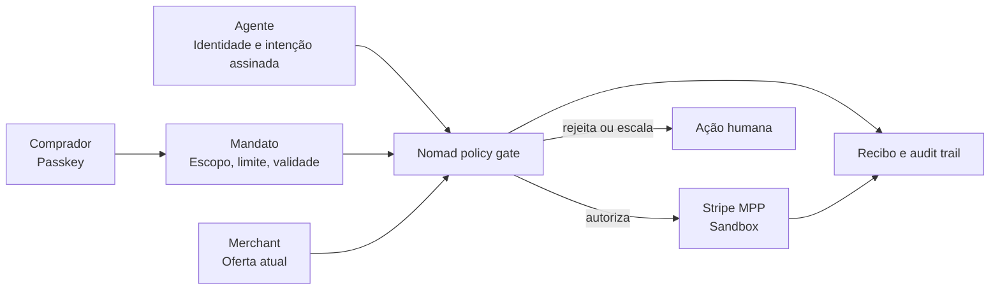

# Draft de pitch — Nomad

_Reavaliado em 30 de agosto de 2026 a partir do estado atual do repositório._

## Recomendação de posicionamento

**Nomad é a camada de confiança para o comércio agêntico.** Ela permite que uma IA encontre e proponha uma compra, mas mantém identidade, limite, vigência, revogação, pagamento e auditoria sob controle verificável de humanos e merchants.

O projeto não deve ser apresentado como “mais um chatbot de compras”. A ideia mais forte é a separação entre inteligência e autoridade:

> **O agente decide o que recomendar. A Nomad decide se ele tem autoridade para comprar.**

Esse posicionamento responde diretamente ao Challenge 01, **The Buyer Who Isn't Human**, e concentra o pitch no problema difícil: como um merchant distingue uma compra agêntica legítima de fraude, sem entregar ao modelo um cartão ou poder irrestrito de gasto.

## Pitch falado — versão de 4 minutos

### 1. Abertura — 30 segundos

> Agentes de IA já conseguem pesquisar, comparar e escolher produtos. Mas o sistema de pagamentos ainda pressupõe que quem clicou em “comprar” é o próprio comprador.
>
> Quando uma IA faz esse clique, o merchant precisa responder perguntas novas: quem autorizou esse agente? Quanto ele pode gastar? Essa autorização ainda está válida? E, se houver uma disputa, quem consegue provar o que aconteceu?
>
> A Nomad nasce para responder essas perguntas.

### 2. Problema — 35 segundos

> Hoje, dar autonomia de compra a uma IA normalmente cria uma escolha ruim: ou o agente pede confirmação humana a cada etapa e perde a autonomia, ou recebe credenciais e poder demais, ampliando o risco de fraude, prompt injection e compras fora de escopo.
>
> Para o merchant, uma mensagem dizendo “meu usuário autorizou” não é evidência. E uma assinatura isolada também não basta se o limite mudou ou o mandato foi revogado segundos antes da compra.

### 3. Solução — 55 segundos

> A Nomad transforma a intenção humana em um mandato de compra: um contrato limitado por produto ou categoria, valor máximo, validade e método de pagamento.
>
> O comprador aprova esse mandato com uma passkey. O agente recebe uma identidade própria e apresenta uma prova criptográfica curta, ligada ao corpo exato da transação. No momento da compra, a API revalida o mandato atual, o limite, a vigência, a revogação, a identidade do agente e a integridade da requisição.
>
> O agente nunca recebe a chave privada da passkey, um cartão bruto, uma chave da Stripe ou acesso direto ao banco. O modelo pode pesquisar e propor. Somente a política determinística do backend pode autorizar.

### 4. Como funciona — 60 segundos

> O fluxo tem quatro passos.
>
> Primeiro, o comprador descreve o que precisa em linguagem natural. O agente consulta um catálogo estruturado e converte o pedido em um mandato revisável.
>
> Segundo, o comprador define o teto e a validade e faz uma aprovação WebAuthn no próprio dispositivo.
>
> Terceiro, o agente seleciona uma oferta e assina uma intenção vinculada ao método, rota, hash do corpo, versão do mandato, nonce e expiração. Essa prova não movimenta dinheiro; ela identifica o ator e torna a intenção verificável.
>
> Quarto, a API aplica as regras atuais e só então inicia o pagamento via Stripe MPP em sandbox. Cada resultado gera evidências para comprador e merchant: o que foi pedido, qual mandato foi usado, qual regra passou ou falhou e qual foi o resultado do pagamento.

### 5. Diferencial — 35 segundos

> O nosso diferencial não é usar IA para escolher o produto. É assumir que a IA é uma parte não confiável do sistema.
>
> Por isso cruzamos três elementos independentes: a sessão humana autenticada por passkey, a identidade Ed25519 do agente e um mandato revogável avaliado no momento da decisão. Nenhum deles, sozinho, autoriza uma compra.
>
> Assim, prompt injection pode influenciar uma recomendação, mas não consegue aumentar o limite, reativar um mandato revogado ou transformar texto em autorização financeira.

### 6. Valor e visão — 30 segundos

> Para compradores, a Nomad oferece autonomia com limites claros e histórico compreensível. Para merchants, oferece mais conversão de tráfego agêntico com uma trilha defensável para risco, operação e disputa.
>
> A visão é disponibilizar essa confiança como infraestrutura: APIs para emissão e verificação de mandatos, identidade de agentes e evidência transacional, integráveis a marketplaces e orquestradores de pagamento.

### 7. Fechamento — 15 segundos

> Agentes não precisam de liberdade irrestrita para comprar. Precisam de autoridade limitada, verificável e revogável.
>
> A Nomad cria essa fronteira: a IA encontra a oportunidade; o humano define a intenção; o merchant verifica a autoridade.

## Roteiro recomendado de slides

| Slide | Título | Mensagem principal | Visual sugerido |
| --- | --- | --- | --- |
| 1 | Quando o comprador não é humano | Pagamentos atuais não distinguem automação legítima de abuso | Uma compra chegando ao merchant com três perguntas: “quem?”, “pode?”, “ainda pode?” |
| 2 | O problema é autoridade, não inteligência | Um LLM pode recomendar, mas não deve ser a fonte de autorização | Separação entre decisão probabilística e política determinística |
| 3 | Nomad: trust layer para agentic commerce | Mandato revogável + identidade do agente + pagamento sem cartão bruto | Diagrama simples do fluxo |
| 4 | O modelo propõe; a política autoriza | Mostrar os checks executados no momento da compra | Lista: identidade, versão, escopo, limite, expiração, revogação e nonce |
| 5 | Demo | Compra válida, mudança ao vivo e nova tentativa bloqueada | Tela do Buyer ao lado da visão do Merchant |
| 6 | Evidência compartilhada | Comprador e merchant enxergam o mesmo evento com projeções adequadas | Recibo, proof ID, regra aplicada e audit trail |
| 7 | Por que é diferente | Segurança nasce da separação de poderes | Três credenciais independentes convergindo na API |
| 8 | De protótipo a infraestrutura | API/SDK B2B para merchants e plataformas | Roadmap curto e próximo passo |

## Diagrama para o slide de solução

## Roteiro de demo — alvo de 4 minutos

O ideal é usar uma única história do início ao fim. Para a interface atual, o monitor ultrawide é a narrativa mais coerente; **VuelaYa deve ficar como fixture técnica do grafo, não como uma segunda história concorrente no pitch**.

### Cena 1 — intenção e mandato

1. No Buyer, enviar: `Buy an ultrawide monitor up to $300`.
2. Mostrar que o agente consulta produtos e devolve um mandato editável, não uma compra imediata.
3. Destacar escopo, teto, validade e método de pagamento.
4. Aprovar com uma passkey real no dispositivo.

**Mensagem falada:** “A linguagem natural inicia o fluxo, mas o texto do chat não é autoridade. A autoridade nasce deste mandato aprovado.”

### Cena 2 — decisão permitida

1. Exibir as ofertas comparadas e a oferta que atende ao limite.
2. Mostrar o recibo ou resultado autorizado.
3. Abrir o workspace do Merchant e localizar a tentativa.
4. Mostrar identidade do agente, proof ID, valor, resultado e trilha de auditoria.

**Mensagem falada:** “O merchant não confia na justificativa do modelo. Ele confia na prova ligada à requisição e nas regras reavaliadas pelo backend.”

### Cena 3 — trial by fire

1. Revogar o mandato ou reduzir o limite para menos que o valor da oferta.
2. Repetir a mesma tentativa sem alterar o código nem intervir no banco.
3. Mostrar a rejeição ou escalada e o novo evento no histórico.

**Mensagem falada:** “A prova anterior não congela a autorização. A Nomad consulta o estado atual; por isso a próxima tentativa falha imediatamente.”

### Restrição para a apresentação atual

Não apresentar a Cena 3 como end-to-end enquanto o frontend Buyer continuar enviando a aprovação para `/api/purchases`, cuja execução é mockada. Até a integração final, há duas alternativas honestas:

- demonstrar o fluxo visual Buyer/Merchant como protótipo de experiência e, separadamente, executar o grafo em `ADAPTER_MODE=demo` para provar allow, escalation e revogação; ou
- concluir o adapter HTTP e ligar o Buyer à criação, execução e revogação autoritativas antes da apresentação.

A segunda opção é a única que prova integralmente o trial by fire em uma única jornada.

## Reavaliação do estado atual

### O que já está implementado

- Frontend unificado **Nomad** com áreas de Buyer e Merchant.
- Chat Buyer conectado por BFF ao serviço de agente e à OpenAI, com Structured Outputs.
- Consulta ranqueada ao catálogo do backend e contexto de conversa persistido quando os serviços estão configurados.
- Registro e autenticação WebAuthn, sessão de passkey e exigência de nova autenticação na aprovação do mandato.
- API para identidades de agente, mandatos versionados e revogáveis, histórico de pagamentos, catálogo e operações de merchant.
- Verificação Ed25519 ligada ao hash do corpo, rota, método, mandato, versão, nonce e curta expiração.
- Checagem cruzada de sessão humana, identidade do agente, propriedade, estado do mandato, escopo e teto.
- Endpoint e catálogo Stripe MPP em sandbox, com desafio HTTP `402`.
- Workspace Merchant com dashboard, catálogo, pedidos, avaliação de risco determinística, evidências, trilha de auditoria, finanças e abertura de casos de refund.
- Grafo LangGraph com seleção de oferta, interrupção para aprovação humana, retomada, rejeição e tratamento explícito de falhas.
- Suites de teste para os três pacotes cobrindo contratos, autenticação, provas, replay, revogação, prompt injection, catálogo, UI e operações de merchant.

### O que ainda é mock, parcial ou pendente

- A compra disparada pela experiência Buyer ainda usa `executeMockPurchase`; ela não percorre a API autoritativa nem Stripe MPP.
- O grafo completo de compra funciona com authority em memória no modo demo. As rotas propostas para seu `ADAPTER_MODE=http` ainda não existem na API.
- Credenciais WebAuthn e sessões Buyer estão em memória no runtime; há migração para persistência, mas ela ainda não está conectada.
- O modo de demonstração Merchant usa dados em memória; o caminho real depende de Supabase Auth, RLS, migrations e configuração.
- A página de histórico do Buyer usa fixtures locais e pedidos de reembolso locais; não é ainda a projeção do audit trail autoritativo.
- Um caso de refund criado no Merchant é apenas uma solicitação operacional. Ele não executa automaticamente uma devolução na Stripe.
- Stripe MPP está delimitado a sandbox e recursos controlados. O projeto não prova compra em qualquer marketplace, uso genérico de USDC nem prontidão para dinheiro real.
- Não há uma visão dedicada de auditor independente; a visão Merchant contém o audit trail mais completo disponível na UI.
- Checkpoints e runs do agente são mantidos em memória, portanto reinício e múltiplas réplicas não são seguros no MVP.

### Validação desta revisão

O código e as suites foram inspecionados, mas não foi possível concluir uma execução limpa dos gates neste ambiente:

- o workspace está usando Node.js `18.19.0`, enquanto os três pacotes dependem de recursos ou declaram requisito de Node.js 22 ou superior;
- `api` e `agent` estão sem os executáveis locais de desenvolvimento instalados;
- o `front` inicia a suite, mas falha no carregamento do toolchain por incompatibilidade com Node.js 18.

Portanto, no pitch, prefira “implementado e coberto pela suite do repositório” a “todos os testes estão passando”, até os gates serem executados em Node.js 22 a partir de uma instalação limpa.

## Claims seguros para usar

- “Construímos um protótipo de comércio agêntico governado.”
- “A IA propõe; somente o backend determinístico autoriza.”
- “O agente não recebe o cartão bruto, a chave da passkey nem segredos da Stripe.”
- “A prova do agente é vinculada aos bytes da requisição e a um mandato versionado.”
- “O backend verifica o estado atual do mandato no momento da decisão.”
- “Temos um fluxo Stripe MPP em sandbox para recursos controlados.”
- “Buyer e Merchant possuem experiências distintas para intenção, operação e evidência.”

## Claims a evitar no estado atual

- “A compra da UI é totalmente end-to-end e usa Stripe MPP.”
- “Compramos em qualquer marketplace externo.”
- “A Nomad está pronta para produção ou dinheiro real.”
- “A biometria assina cada compra do agente.” A passkey autentica a ação humana; a prova posterior pertence à identidade do agente.
- “MPP é o mesmo que pagamento em USDC.” O rail implementado é Stripe MPP em sandbox.
- “Temos refund inteligente automatizado.” Hoje existem uma API Stripe de refund e casos operacionais separados, não uma decisão autônoma completa.
- “Temos três visões autoritativas completas.” Buyer e auditor ainda possuem projeções incompletas ou demonstrativas.

## Perguntas prováveis da banca

### Por que não deixar o próprio LLM verificar o mandato?

Porque a saída de um modelo é probabilística e pode ser influenciada por conteúdo não confiável. Na Nomad, o modelo escolhe ou recomenda uma oferta, enquanto regras determinísticas verificam identidade, escopo, limite, vigência e revogação.

### A assinatura do agente já não seria suficiente?

Não. A assinatura prova qual credencial produziu uma intenção e protege sua integridade, mas não prova que o mandato continua ativo. A API cruza a assinatura com a sessão do comprador e com o estado atual e versionado do mandato.

### Como vocês evitam replay?

A prova inclui nonce, janela curta de validade e compromisso com método, rota e hash do corpo. O desenho prevê consumo atômico do nonce no boundary autoritativo; o fluxo demonstrativo cobre rejeição de replay.

### O agente tem acesso ao cartão ou à biometria?

Não. A chave privada da passkey permanece no autenticador do usuário. O agente também não recebe cartão bruto, chave Stripe, credencial MPP reutilizável ou segredo de banco.

### O que acontece se o mandato for revogado durante uma aprovação humana?

O backend precisa revalidar mandato e versão na retomada, não apenas antes da pausa. No grafo demonstrativo, revogação durante a espera resulta em rejeição.

### O que é real e o que é sandbox?

WebAuthn, as fronteiras de serviço, as verificações criptográficas, as APIs, o catálogo, as projeções e o endpoint MPP existem no código. Stripe MPP é sandbox. A compra da UI e o workspace Merchant podem operar com dados mockados para a demo; o adapter HTTP completo do grafo de compra ainda é um contrato proposto.

### Qual seria o modelo de negócio?

Hipótese inicial B2B: infraestrutura de verificação para merchants, marketplaces e orquestradores de pagamento, cobrada como plataforma mais uso por tentativa verificada. Essa é uma direção de produto, ainda não uma hipótese comercial validada.

## Frase final alternativa

> O futuro do comércio agêntico não depende apenas de agentes mais inteligentes. Depende de uma forma verificável de dizer: este agente, deste comprador, pode fazer esta compra, por este valor, agora. Essa é a Nomad.
