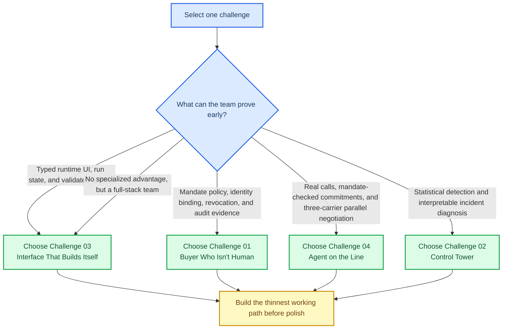

# Track selection guide

_A team-facing decision guide for selecting one NextWave challenge without confusing a strategic recommendation with an official track assignment or participation data._

---

## Decision in one sentence

**Default choice: Challenge 03, The Interface That Builds Itself.** It offers the strongest expected score for a team without a proven real-time voice advantage: the mechanism is original, every critical dependency can be controlled, and a judge can directly test whether a changed workflow produces a changed interface.

This is a recommendation, not an official assignment to Yuno or Nauta and not evidence that a crew has selected the track. A crew must still choose exactly one challenge and cannot change it later.[^overview]

## What is known and what is inferred

The challenge briefs and evaluation guidelines are the source of truth for requirements and judging. They do not report registrations, team composition, or expected number of submissions by track. Any claim about relative competitiveness in this guide is therefore an explicit inference from the engineering burden, demo surface, and likely appeal of each problem.

| Topic | Status | Basis |
| --- | --- | --- |
| Track objectives, required live proof, ugly cases, trial by fire, and technical defense | Documented fact | The four challenge specifications |
| Working behavior and technical judgment matter more than breadth or spectacle | Documented fact | Evaluation guidelines |
| Challenge 03 has the strongest expected-value profile for a general full-stack team | Recommendation | It can demonstrate original runtime behavior while avoiding the external reliability dependencies of real telephony |
| Challenge 01 can beat Challenge 03 for a team with unusually strong authorization, security, and backend design capability | Recommendation | Its trial by fire is a direct test of policy enforcement, revocation, and evidence rather than presentation polish |
| Challenge 04 retains the highest raw demo ceiling but has the highest reliability risk | Inference | Real phone-network calls, parallel negotiation, auditable commitments, and escalation create a large public failure surface |

> The only way to replace the competitiveness inferences with evidence is to obtain registration counts or a credible organizer view. `notes.md` records this gap as a question to resolve.

## Decision model

The right track is not the one with the longest feature list. The jury prioritizes working behavior, technical depth and judgment, fit to the real problem, originality, and clarity. A project should therefore be selected by the hardest behavior the team can make reliable before the final presentation.[^evaluation]

## Comparative recommendation

| Challenge | Likely relative selection pressure | Expected score reliability | Maximum demo ceiling | Best reason to choose | Main reason to decline |
| --- | --- | --- | --- | --- | --- |
| 01: The Buyer Who Isn't Human | High | High for a policy and backend team | High | An agent-authorization control plane can be rigorous, legible, and hard to fake | A generic checkout assistant will blend in |
| 02: The Control Tower | Medium-low | Medium-high | High | Serious analytical depth with a bounded failure surface | A dashboard can look conventional unless diagnosis is visibly causal and survives an unseen injected slice |
| 03: The Interface That Builds Itself | Medium | High for a strong full-stack workflow team | Very high | A workflow-to-interface compiler makes the live trial visually and technically undeniable | Fixed screens with generated text fail the actual brief |
| 04: The Agent on the Line | Low | Low-medium unless voice is a proven team strength | Very high | Real conversational autonomy can produce the strongest presentation moment | Telephony, latency, barge-in, and state consistency can fail publicly |

The ratings in this table are comparative inferences. They are not attendance forecasts.

## Adversarial reconsideration

The first version of this guide chose Challenge 04 by emphasizing its presentation ceiling. That was incomplete. The evaluation criteria say working behavior beats promised behavior and judgment beats spectacle.[^evaluation] A general recommendation must optimize for a convincing prototype under a live trial, not only for the most dramatic possible moment.

### The serious case for Challenge 01

Challenge 01 becomes exceptional when it is framed as an **agent-authorization control plane**, not an agent that happens to click a checkout button.

| Weak entry | Differentiated entry | Why the difference matters |
| --- | --- | --- |
| A chatbot finds an item and pays | A merchant verifies a scoped, revocable, human-issued capability before every decision | The mandate is the product, not a settings screen |
| A static approval flag | A policy evaluator enforces price, category, expiry, frequency, and identity constraints at the moment of purchase | The judge can change state live and observe a deterministic outcome |
| A transaction history | A three-party evidence view for buyer, merchant, and auditor | It makes disputes and trust legible |
| A generic fraud warning | An adversarial agent test that attempts scope escalation, impersonation, and post-revocation spending | It proves the system fails safely |

The ambitious version is an **intent compiler**: a human statement such as “buy a flight to Córdoba below $150, no more than three times this month” becomes a signed, machine-checkable authority object. The buyer sees intent. The agent receives only constrained authority and never receives the raw card. The merchant sees verifiable proof and current revocation status.

That is a strong answer to the brief because it makes the difficult question concrete: how can a merchant trust a non-human purchaser without confusing the purchaser with the human? It can be both technically deep and easy for a judge to test. A live revocation, an attempted scope escape, and an auditor replay create better proof than a broad catalog or many payment integrations.

**Choose Challenge 01 over Challenge 03 or 04 when** the team is strongest in security, backend systems, cryptography, payments, or policy engines, and can explain authority boundaries more clearly than it can build a real-time interface. Its main risk is strategic, not operational: the team must avoid looking like every other shopping agent.

### The serious case for Challenge 03

Challenge 03 becomes exceptional when it is framed as a **workflow-to-interface compiler**, not an LLM that writes components.

| Weak entry | Differentiated entry | Why the difference matters |
| --- | --- | --- |
| A fixed logistics dashboard with generated summaries | A typed workflow graph that emits a constrained UI model for each run | The interface is derived from state rather than decorated with AI |
| A static approval button | Run-scoped actions that change the workflow and cause an immediate UI transformation | The human genuinely redirects the same run |
| A manually designed screen for each scenario | A renderer that maps new workflow nodes to allowed review surfaces | The judge can add work and see the interface adapt without frontend edits |
| Free-form generated HTML | A capability-limited component registry, action validation, and evidence links | The project has a credible security and reliability story |

The ambitious version is an **operations compiler**. The agent publishes a typed run graph containing facts, uncertainty, allowed actions, and evidence. A renderer projects that graph into the smallest relevant workspace. When the flow gains Bill-of-Lading validation, the UI does not merely add a sentence. It creates an evidence-comparison surface, exposes the allowed decisions, and returns the selected outcome to the same run.

Inference: this track can create the strongest jury interaction of all four challenges when the team makes the changed-flow behavior legible. A judge changes the flow definition live, sees a UI diff appear, makes a decision in the new surface, and watches the agent re-plan. That directly exercises the stated trial by fire and jury criteria for working behavior, originality, and technical judgment.[^challenge03][^evaluation]

**Choose Challenge 03 over Challenge 01 or 04 when** the team has a strong full-stack builder who can own live state, a constrained UI schema, and an event-driven workflow. It is the default recommendation because it makes originality, technical judgment, and trial-by-fire reliability reinforce each other.

## Challenge 01: The Buyer Who Isn't Human

### Why pick it

- The problem is immediately legible: a merchant needs to accept an agent acting for a human without giving the agent a raw card.
- The mandate is a powerful product primitive. It creates a coherent story around authority, item scope, payment limits, expiry, revocation, merchant verification, and disputes.
- The trial by fire is concrete. A judge changes or revokes a mandate, attempts another purchase, and the system must enforce the current state without help.[^challenge01]
- A strong project can defend real security decisions rather than only show model behavior: signed mandates, agent identity binding, revocation checks, capability limits, and a readable audit record.
- The build can use mocked catalog and payment data, leaving time to make the control plane robust.[^challenge01]

### Why not pick it

- Inference: agentic commerce and payment authorization are a natural hackathon choice, so several teams may converge on a purchase-agent demo.
- A polished purchase flow is not enough. The project will look shallow if it treats a mandate as a static checkbox, stores a card token where the agent can reach it, or checks revocation only once.
- The challenge rewards ugly cases. Out-of-scope purchases, expiry, impersonation, disputes, and live revocation must change the actual decision, not merely display an error message.[^challenge01]
- The distinction between an agent chat experience and a defensible authorization system is difficult to make obvious in a short demo.

### What a winning version would make undeniable

A human creates a scoped mandate, then an identifiable agent completes discovery, decision, and a permitted purchase without receiving the raw card. The merchant verifies the human-issued mandate at decision time, the human receives the purchase record, and the buyer, merchant, and auditor can independently read the resulting evidence. The team then has a judge revoke the mandate live and proves that the next request fails.[^challenge01]

### Early disqualifier

Do not choose this track if the team intends to show a static permit record, a simulated revocation, or a post-hoc audit log. The control must participate in every decision.

## Challenge 02: The Control Tower

### Why pick it

- It has a deep technical core that is easy to defend when implemented well: expected behavior, statistically meaningful deviations, dimension search, evidence quality, confidence, impact, and prioritization.
- It is less dependent on model theatrics. A hybrid approach can use deterministic detection and slice analysis for truth, then use an LLM only to summarize evidence and explain a recommendation.
- The brief explicitly rewards a system that says evidence is insufficient. That creates an opportunity to demonstrate judgment rather than alert spam.[^challenge02]
- Two simultaneous incidents and a judge-injected unseen combination make a good live demonstration of generalization rather than hard-coded scenarios.[^challenge02]
- It naturally produces two usable views: an operations diagnosis with supporting slices and an executive view with estimated financial impact.

### Why not pick it

- The core visual object is likely a control panel. Unless the root-cause logic is vivid and correct, it can look like a familiar dashboard with AI-written explanations.
- The trial by fire punishes narrow, precomputed rules. A new intersection of merchant, provider, method, country, issuing bank, or decline code must still be found and supported by evidence.[^challenge02]
- Baseline design is where credibility is won or lost. A simple threshold may confuse normal time-of-day or weekend variation with an incident.
- The brief requires a recommendation for a human, not autonomous remediation. Teams that over-automate can move away from the stated problem.[^challenge02]

### What a winning version would make undeniable

A transaction stream remains quiet during ordinary variation. When two incidents occur, the system separates them, states when each began, identifies affected dimensions, quantifies impact, exposes evidence, ranks urgency, and recommends a human action. When a judge injects a new slice, the system finds it without a manual query rewrite.

### Early disqualifier

Do not choose this track if the team plans to label handcrafted anomalies as AI diagnosis. The project needs a general dimension-search path and an explainable baseline before the UI matters.

## Challenge 03: The Interface That Builds Itself

### Why pick it

- It offers a distinctive thesis: a workflow agent emits a constrained interface from the work it is doing, not from a fixed screen catalog.
- The human-in-the-loop requirement is valuable. A supervisor decision must change the same run and the UI must visibly restructure in response.[^challenge03]
- It can be visually impressive without depending on external phone infrastructure or payment integrations.
- The security question is strong. A serious entry can show schema-constrained rendering, action allowlists, run-scoped validation, and renderer capability limits instead of arbitrary generated client code.
- The logistics scenario gives clear state transitions, documents, route changes, ETA slips, and decisions that can drive a legible UI transformation.[^challenge03]

### Why not pick it

- The common failure is a fixed logistics dashboard with LLM-generated text. That does not prove the UI comes from run state or that changing the flow changes the interface.
- A fully open-ended generated UI is a security and quality trap. Without a small, intentional UI schema, the result can become a collage of unstable components.
- The live trial is unforgiving: judges add a workflow step such as Bill-of-Lading validation, and the system must show the new work without a manually created screen.[^challenge03]
- The project can spend too much time polishing components while missing the runtime contract between agent, run state, renderer, and validated human action.

### What a winning version would make undeniable

The agent emits a typed, constrained UI model from workflow state. A run streams changes into the renderer. A human makes a validated decision. The agent changes route within that same run. Then a judge adds a new workflow step and the renderer creates the corresponding review surface without a frontend change.

### Early disqualifier

Do not choose this track if the team cannot define a safe UI schema and a real run-state protocol before beginning frontend implementation. The necessary proof is dynamic structure, not dynamic wording.

## Challenge 04: The Agent on the Line

### Why pick it

- It creates the clearest live moment. A judge can call the system or act as a dispatcher, change terms, interrupt, refuse, or claim authority the agent does not have. The team can show the agent reach a compliant outcome or escalate in real time.[^challenge04]
- The brief requires real outbound and inbound phone-network calls, parallel carrier comparison, mandate-constrained negotiation, written recaps, audio-linked commitments, system updates, and live human takeover. That high bar likely deters teams that only have a voice demo.[^challenge04]
- The project connects conversational AI to an operational result. A successful call becomes a structured commitment with price, pickup window, counterparty, governing mandate, recap, and audio timestamp.[^challenge04]
- It has room for genuine originality without feature sprawl: call-brief generation, commitment confidence, negotiation state, constraint-aware alternatives, synchronized operation state, and escalation context.
- The technical defense is substantive. The team can explain telephony boundaries, mandate checks before commitment, record linkage, data consistency, and handoff continuity.[^challenge04]

### Why not pick it

- It is the most failure-prone track. Real phone-network routing, audio latency, interruptions, speech recognition errors, background noise, accents, and tool-call timing can break the experience in public.
- The build must not confuse a transcription with a commitment. The recap must be sent and the operation record must agree with what was actually accepted on the call.[^challenge04]
- Parallel negotiation increases state-management complexity. The system must avoid double-booking or accepting stale terms while it compares carriers.
- A convincing human takeover is harder than a transfer button. The operator needs the active mandate, conversation context, current offer, and reason for escalation before speaking.
- The project can become a voice novelty if it does not show a real operational state transition and audit trail.

### What a winning version would make undeniable

Volta receives an operation with a price and time mandate, calls carriers through the actual telephone network, compares offers, checks a proposed commitment before accepting it, sends a written recap, and records the result against the operation. A later inbound call changes the conditions. Volta renegotiates within authority or transfers the live call to a human with all relevant context intact.

### Early disqualifier

Do not choose this track unless the team can complete one real end-to-end feasibility call early: obtain a quote, invoke a mandate check, send a recap, record a timestamped commitment, and complete or escalate the action. That single call is only a feasibility test. The final system must also compare at least three carriers through real calls in parallel.[^challenge04] A browser-only voice conversation does not satisfy the stated requirement.

## Recommended project scope for Challenge 04

The recommended build is **Volta, an autonomous drayage desk**. Its purpose is not to imitate a general voice assistant. Its purpose is to turn constrained carrier conversations into verified operational commitments.

| Layer | Minimum working behavior | Do not build first |
| --- | --- | --- |
| Telephony | Place and compare at least three outbound carrier calls in parallel, then accept an inbound call on real phone numbers | Broad provider support or a custom dialer |
| Conversation | Ask for a quote, confirm pickup terms, handle one interruption, and state a clear next action | Open-ended personality or multilingual improvisation |
| Authority | Check price, pickup window, and conditions against one stored mandate before accepting | Complex policy authoring |
| Commitment | Save counterparty, terms, mandate reference, audio timestamp, and recap delivery status | A full contract system |
| Operations | Update the shipment with the verified commitment or escalation status | A complete transport-management system |
| Escalation | Keep the call alive while a human receives context and takes over | A generalized contact-center platform |

### The first proof

Before designing a full dashboard or market-intelligence layer, make a 90-second path reliable:

1. Load a shipment and mandate.
2. Dial a controlled carrier test number.
3. Receive a quote and pickup window.
4. Call the mandate check before acceptance.
5. Send a written recap.
6. Write the commitment and audio reference to the operation.
7. Run an inbound exception that either changes the operation within authority or escalates to a human.

The one-call path is a feasibility spike, not the complete challenge. Before committing to Challenge 04, prove a three-carrier parallel path that compares the offers and records only one mandate-compliant commitment. This is a non-negotiable requirement of the final demo.[^challenge04]

If the feasibility path or the three-carrier parallel validation cannot be demonstrated early, do not choose Challenge 04. Return to the default Challenge 03 unless the team's demonstrated advantage is payment-incident diagnosis, in which case select Challenge 02. That is a strategic cut, not a failure.

## Final decision

**Challenge 03, The Interface That Builds Itself, is the better default choice.** It has the best balance of originality, controllable engineering risk, and direct evidence under a live trial.

The original Challenge 04 recommendation optimized for maximum spectacle. The revised decision optimizes for the judging principles: a working end-to-end prototype and a defensible technical judgment beat difficulty or dramatic presentation alone.[^evaluation]

| If the team has this proven advantage | Choose | Reason |
| --- | --- | --- |
| Strong full-stack workflow engineering, live state, and schema-driven rendering | Challenge 03 | The team can build an operations compiler that visibly adapts to a live flow change |
| Authorization, security, payments, policy engines, and audit systems | Challenge 01 | The team can build verifiable delegated purchasing authority instead of a generic agent checkout |
| Real-time voice, telephony, operational state synchronization, and live escalation | Challenge 04 | The team can pursue the largest demo ceiling after proving the full real-call path |
| Statistical detection and interpretable incident diagnosis | Challenge 02 | The team can build a credible diagnostic system without forcing a weaker fit |

For a team with no demonstrated specialized advantage, select **Challenge 03**. For a security and backend-led team, Challenge 01 is the most credible alternative and may be the better choice. Choose Challenge 04 only after proving real telephony, mandate-checked commitments, and three parallel carrier calls early. That is a team-fit override, not the general default.[^challenge04]

[^overview]: [Hackathon overview](./hackathon-overview.md)
[^evaluation]: [Evaluation guidelines](./evaluation-guidelines.md)
[^challenge01]: [Challenge 01: The Buyer Who Isn't Human](./challenge-01-buyer-who-isnt-human.md)
[^challenge02]: [Challenge 02: The Control Tower](./challenge-02-control-tower.md)
[^challenge03]: [Challenge 03: The Interface That Builds Itself](./challenge-03-interface-that-builds-itself.md)
[^challenge04]: [Challenge 04: The Agent on the Line](./challenge-04-agent-on-the-line.md)
