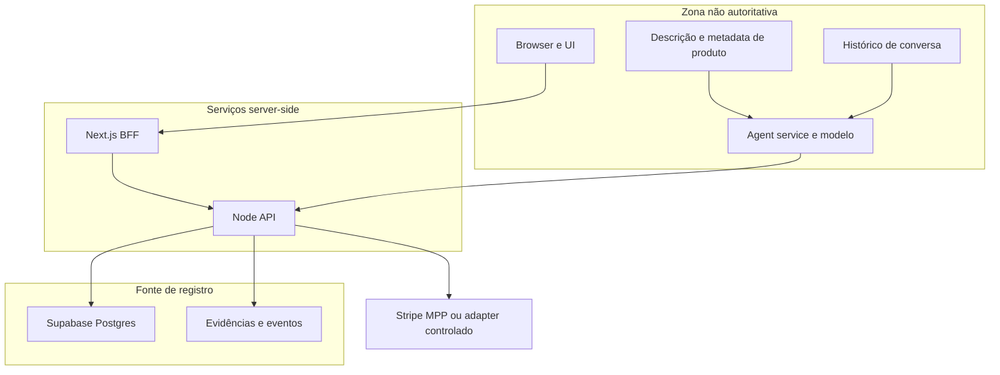

# Transfer log e decision log do projeto Nomad

**Data do registro:** 30 de agosto de 2026  
**Repositório:** `rbfcdog/brasilia-dog`  
**Branch de referência:** `main`  
**Objetivo deste documento:** transferir contexto técnico, decisões, limites, riscos e próximos passos para qualquer pessoa que precise continuar, demonstrar, revisar ou operar o projeto sem depender do histórico da conversa.

> Este documento é um registro de transferência, não uma promessa de que toda a arquitetura planejada já está implementada. Quando houver diferença entre intenção, contrato e código, a classificação neste arquivo deve prevalecer até que o código e a documentação sejam reconciliados.

---

## 1. Resumo executivo

Nomad é uma plataforma de comércio agentivo governado. Uma pessoa define uma autorização limitada, chamada **mandate**. Um agente pode pesquisar produtos e propor ou executar uma ação dentro desse limite, mas não possui poder de gasto próprio.

A tese central é:

> O agente nunca recebe spending power. Ele produz uma assinatura ou uma proposta; a assinatura é evidência, não permissão.

A decisão final de autorização permanece no backend Node.js. O backend revalida o estado atual do usuário, do agente, do mandate, do produto, da oferta, do endpoint, do limite, da expiração e do replay antes de qualquer caminho de pagamento.

A separação fundamental é:

```text
Pessoa
  -> passkey e presença recente

Agente
  -> identidade técnica e prova assinada

Mandate
  -> escopo, limite, validade, versão e revogação

Node API
  -> decisão determinística de autorização

Supabase Postgres
  -> estado relacional, transações, projeções e evidências

Payment adapter
  -> só recebe uma ação previamente autorizada
```

O projeto foi construído para o Challenge 01, "The Buyer Who Isn't Human", com foco em demonstrar controle, revogação, identidade, prova auditável e separação entre descoberta por IA e autorização financeira.

---

## 2. Como usar este handoff

Antes de alterar o sistema:

1. Leia a seção 3 para entender o estado real.
2. Leia as decisões D-001 a D-016 antes de substituir um componente ou alterar uma fronteira.
3. Consulte a seção 7 para não transformar uma integração planejada em uma afirmação de que ela existe.
4. Consulte a seção 8 antes de rodar uma demonstração com dinheiro real.
5. Consulte a seção 9 para verificar os contratos entre browser, BFF, API, agente e banco.
6. Reexecute os testes dos três serviços antes de publicar qualquer mudança.
7. Se uma nova decisão alterar autoridade, identidade, pagamento, persistência ou exposição de dados, acrescente uma nova entrada neste documento e atualize `docs/decision-log.md`.

Este arquivo não substitui:

- `docs/decision-log.md`, que registra as decisões de arquitetura do code freeze;
- `api/docs/stripe-mpp-production-runbook.md`, que contém os gates para Stripe MPP;
- `agent/docs/backend-contract.md`, que contém o contrato HTTP do agente;
- `agent/docs/api-gateway-chat-architecture.md`, que registra o caminho de chat;
- `api/docs/adr-0001-supabase-primary-data-platform.md`, que registra a escolha do Supabase.

---

## 3. Estado atual e classificação de evidência

### 3.1 Implementado no repositório

Os seguintes blocos existem no código e possuem testes ou contratos correspondentes:

- API Node.js com Express, CORS, health check e OpenAPI.
- Supabase Auth e Postgres como fonte de estado relacional.
- Identidades técnicas de agentes com Ed25519.
- Passkeys WebAuthn para autenticação e presença do comprador.
- Sessões de passkey e verificação de sessão no backend.
- Mandates com escopo, limite, expiração, versão e revogação.
- Provas de agente vinculadas a método, caminho, corpo, nonce, mandate e versão.
- Proteção contra replay, expiração, alteração de corpo e identidade incorreta.
- Catálogo de produtos, ofertas Stripe MPP e endpoints controlados.
- Busca de catálogo com PostgreSQL full text search, `tsvector`, índice GIN e filtros de preço.
- Ferramentas do agente para busca, categorias e comparação.
- Validação de respostas estruturadas do OpenAI com Zod.
- Rejeição de produtos que não vieram do catálogo autorizado.
- Persistência de conversas no backend para usuários autenticados.
- BFF Next.js com cookies HttpOnly e caminhos allowlisted.
- Área de comprador, histórico, área de merchant, catálogo, pedidos e finanças.
- Projeções de merchant com comandos de criação, publicação e abertura de caso de refund.
- Modo demo com passkey demo, separado da cerimônia WebAuthn real.
- Persistência de `ownerId` no run do agente, corrigida no commit `3888c94`.
- Testes de contrato e de fronteira entre frontend, API e agente.

### 3.2 Contrato definido ou demonstrado por adapter

Os seguintes elementos têm interfaces e testes de contrato, mas não devem ser tratados como integração live completa:

- Assinatura remota de provas de agente.
- Apresentação de compra por HTTP.
- Resume após escalonamento humano.
- Adapter HTTP do agente para o backend.
- Fluxo LangGraph de descoberta, seleção, prova, apresentação e resume.
- Integração do agent service com catálogo autorizado.

Um adapter testado prova formato, validação e fronteira. Não prova que todos os serviços externos, credenciais, migrações e operações de produção estão ativos.

### 3.3 Simulado, incompleto ou bloqueado

- O caminho de compra do frontend ainda contém uma execução determinística/mockada em partes do fluxo.
- O modo demo usa estado local e chave efêmera para permitir demonstração sem infraestrutura de produção.
- O Stripe MPP live não deve ser usado sem os gates do runbook.
- O catálogo seed e a busca indexada dependem da aplicação das migrações no Supabase live.
- A aplicação dessas migrações estava bloqueada neste ambiente por conectividade IPv6 do host Supabase.
- O agente e a UI possuem contratos de marketplace mais novos que partes do grafo e dos contratos de voo existentes; esse drift precisa ser verificado antes de declarar uma compra marketplace end to end.
- Não existe comprovação neste documento de uma compra real em marketplace externo.

---

## 4. Tese de produto e modelo mental

### 4.1 O que o produto resolve

Sistemas tradicionais assumem que a pessoa que pressiona o botão de pagamento é o comprador. Em comércio agentivo, essa suposição desaparece. O agente pode descobrir, escolher e solicitar uma compra em outro momento e processo.

Nomad substitui essa suposição por evidências separadas:

| Elemento | Pergunta respondida | O que não prova |
| --- | --- | --- |
| Passkey | Uma pessoa autenticou uma ação recente? | Que qualquer compra futura está autorizada |
| Identidade Ed25519 | Qual agente assinou esta solicitação? | Que a solicitação é permitida |
| Mandate | Qual escopo, limite e validade foram concedidos? | Que o estado ainda não foi revogado ou alterado |
| Política Node | Esta ação é permitida agora? | Que um provedor externo liquidou a transação |
| Prova de execução | Quais bytes, rota, nonce e versão foram apresentados? | Que o conteúdo era verdadeiro fora das fontes confiáveis |
| Receipt | Qual resultado foi recebido do adapter? | Que uma nova compra futura está autorizada |

### 4.2 O que o produto não é

- Não é um chatbot com acesso irrestrito à web.
- Não é um sistema que entrega a senha, passkey privada ou cartão ao agente.
- Não é uma autorização permanente carregada pelo modelo.
- Não é checkout genérico para qualquer loja externa.
- Não é uma afirmação de que Stripe MPP seja uma autorização universal de marketplace.
- Não é uma tentativa de fazer o LLM decidir se dinheiro pode se mover.

---

## 5. Arquitetura de confiança

### 5.1 Zonas de confiança



### 5.2 Regra de autoridade

A regra operacional é simples:

```text
Modelo pode interpretar e recomendar.
Node pode autorizar ou negar.
Postgres registra e impõe invariantes.
Browser exibe e inicia cerimônias.
```

Qualquer mudança que permita ao agente escrever diretamente em mandates, provas, payment attempts, refunds ou audit events viola a decisão D-002 e deve ser rejeitada ou registrada como uma nova decisão explícita.

### 5.3 Três fatos que devem continuar independentes

Uma compra governada depende da concordância de:

1. Presença humana recente, obtida por sessão passkey.
2. Identidade e intenção técnica do agente, obtidas por prova Ed25519.
3. Autoridade atual, obtida por mandate e política backend.

Nenhum desses fatos deve ser convertido em um bearer token único e permanente.

---

## 6. Decision log consolidado

Cada decisão abaixo contém motivo, alternativa rejeitada, custo aceito, evidência e gatilho de revisão.

### D-001. Challenge 01 e comércio agentivo governado

**Decisão:** manter o produto focado em `The Buyer Who Isn't Human` e em compras governadas.

**Motivo:** o diferencial é provar autorização delegada, não apenas mostrar recomendação de produto. O fluxo precisa responder a revogação, limite, expiração, identidade, replay e disputa.

**Alternativas rejeitadas:** shopping copilot genérico, navegador autônomo irrestrito e demonstração puramente visual de checkout.

**Custo aceito:** menos amplitude de catálogo e menos integrações externas.

**Evidência:** `api/docs/track-01-product-direction.md`, `docs/decision-log.md` e o fluxo de mandate no frontend e na API.

**Revisar quando:** cada nova capacidade tiver escopo, risco, autoridade, falha e testes próprios.

### D-002. Node.js como única autoridade financeira

**Decisão:** apenas a API Node.js autentica ações de autoridade, verifica estado atual, grava evidência e chama adapters de pagamento.

**Motivo:** browser e modelo são superfícies expostas a manipulação, prompts e conteúdo de terceiros.

**Alternativas rejeitadas:** agente chamando Stripe ou Supabase diretamente; browser fazendo writes privilegiados; múltiplos policy engines independentes.

**Custo aceito:** mais hops, dependência de disponibilidade da API e manutenção de contratos.

**Evidência:** `api/src/bootstrap/index.ts`, `api/src/http/app.ts`, `api/src/services/cross-credential-auth.ts`, `front/src/app/api/backend/[...path]/route.ts`.

**Revisar quando:** houver escala suficiente para separar serviços por ownership sem distribuir a decisão transacional.

### D-003. IA para descoberta e proposta, código determinístico para autorização

**Decisão:** o OpenAI Responses API pode pesquisar, comparar e montar uma proposta estruturada. Ele não decide `allow`, `reject` ou `escalate`.

**Motivo:** semântica é útil para interpretar linguagem natural; limites, expiração, revogação, ownership, nonce e pagamento precisam ser determinísticos.

**Alternativas rejeitadas:** perguntar ao modelo se a compra é permitida; deixar o modelo decidir com base em texto de produto; remover IA e perder descoberta natural.

**Custo aceito:** o agente falha fechado quando a resposta é inválida ou uma dependência não está disponível.

**Evidência:** `agent/src/chat.ts`, `agent/src/selector.ts`, schemas Zod e testes de output inválido e prompt injection.

**Revisar quando:** existir avaliação offline, versionamento de prompt/modelo, limites de custo, kill switch e política por ferramenta.

### D-004. LangGraph explícito em vez de framework geral de agente

**Decisão:** usar um grafo pequeno com nós nomeados, estado tipado, interrupt e resume.

**Motivo:** o fluxo tem uma pausa de aprovação e precisa de transições observáveis, mas não precisa de filesystem, delegação ou planejamento arbitrário.

**Alternativas rejeitadas:** `deepagents` e uma sequência opaca de chamadas sem checkpoint explícito.

**Custo aceito:** workflows novos exigem evolução deliberada do grafo.

**Evidência:** `agent/src/graph.ts` e `agent/test/graph.test.ts`.

**Revisar quando:** dois ou mais workflows compartilharem estados e políticas reais. Antes de múltiplas réplicas, o estado deve ser durável e criptografado.

### D-005. Passkey humana separada da identidade do agente

**Decisão:** passkey prova presença e aprovação humana; Ed25519 identifica o agente técnico.

**Motivo:** entregar a passkey do comprador ao agente confundiria identidade humana com identidade de execução e ampliaria o impacto de comprometimento do agente.

**Alternativas rejeitadas:** somente passkey; somente assinatura do agente; passkey privada disponível ao modelo.

**Custo aceito:** enrollment, sessão, rotação e revogação são fluxos separados.

**Evidência:** `front/src/hooks/use-passkey.ts`, `api/src/services/passkey-service.ts`, `api/src/services/cross-credential-auth.ts`.

**Revisar quando:** forem definidos recovery, re-enrollment, device management e políticas de step-up por risco.

### D-006. Prova assinada vinculada à ação exata

**Decisão:** `agent-proof-v1` inclui identidade, key ID, método, caminho, hash do corpo canônico, mandate ID, versão, nonce, emissão e expiração.

**Motivo:** uma assinatura genérica pode ser reutilizada em outra rota, com outro corpo ou depois de mudança do mandate.

**Alternativas rejeitadas:** bearer token longo; assinatura apenas do product ID; JWT geral de autorização.

**Custo aceito:** serialização é parte do protocolo, relógios precisam de tolerância e nonce exige armazenamento confiável.

**Evidência:** `api/src/services/agent-proof.ts`, `agent/src/graph.ts`, `agent/test/proof.test.ts`.

**Revisar quando:** nonce consumption e attempt reservation puderem ser uma transação única com testes de concorrência.

### D-007. Remote signer como destino; chave efêmera apenas no demo

**Decisão:** a arquitetura alvo usa assinatura remota sem exportar private key. O modo demo pode usar chave efêmera em processo.

**Motivo:** o agente não deve custodiar uma chave privada de valor durável.

**Alternativas rejeitadas:** private key persistente no worker; somente bearer token; alegar KMS sem KMS provisionado.

**Custo aceito:** HTTP mode ainda depende de rotas e infraestrutura de signer não totalmente conectadas.

**Evidência:** `agent/src/adapters.ts`, `agent/src/agent-identity.ts`, `agent/docs/backend-contract.md`.

**Revisar quando:** KMS ou HSM não exportável, workload identity, rotação, política por agente e auditoria de assinatura estiverem ativos.

### D-008. Supabase Postgres como fonte relacional de registro

**Decisão:** usar Supabase Postgres, Auth, RLS e Storage protegido; manter mutações de autoridade atrás do Node.

**Motivo:** mandates, agentes, versões, provas, payment attempts, receipts, refunds e auditoria têm relações e invariantes transacionais.

**Alternativas rejeitadas:** Firestore como padrão, banco self-hosted no hackathon e writes diretos do browser.

**Custo aceito:** dependência do provedor, risco operacional de service role key e necessidade de migrations rigorosas.

**Evidência:** `api/docs/adr-0001-supabase-primary-data-platform.md` e `api/supabase/migrations/`.

**Revisar quando:** volume, compliance, plano, recovery ou modelo de roles exigirem outro Postgres gerenciado.

### D-009. BFF same-origin para o browser

**Decisão:** o browser chama rotas Next.js same-origin. O BFF lê cookies, verifica sessão, injeta tokens server-side e permite apenas caminhos definidos.

**Motivo:** nenhum service token, segredo Supabase, segredo Stripe, segredo OpenAI ou passkey privada deve chegar ao browser.

**Alternativas rejeitadas:** browser chamando API e Supabase diretamente; proxy catch-all sem allowlist.

**Custo aceito:** existe duplicação de conhecimento de rotas e risco de drift entre BFF e backend.

**Evidência:** `front/src/app/api/backend/[...path]/route.ts`, `front/src/app/api/agent-runs/` e `front/src/lib/api.ts`.

**Revisar quando:** houver clientes não web, OAuth explícito, CSRF centralizado, rate limiting e observabilidade de origem.

### D-010. Chat autenticado commitado no backend antes da resposta

**Decisão:** persistir o user turn antes de chamar o agente e persistir resposta e eventos antes de responder ao browser.

**Motivo:** a UI não deve parecer bem-sucedida enquanto a conversa não foi registrada.

**Alternativas rejeitadas:** browser coordenando writes; agente escrevendo no Supabase; resposta antes do commit.

**Custo aceito:** uma falha após o user turn pode deixar um turno sem assistant turn, mas isso é estado honesto e recuperável.

**Evidência:** `api/src/services/backend-chat-service.ts`, `api/test/backend-chat.test.ts`, `agent/docs/api-gateway-chat-architecture.md`.

**Revisar quando:** houver outbox, estados `pending` e `failed`, retry idempotente, retenção e backpressure.

### D-011. Busca PostgreSQL indexada em vez de baixar o catálogo inteiro

**Decisão:** usar `search_document` ponderado, índice GIN, filtros SQL e RPC `search_agent_mpp_products`.

**Motivo:** baixar e filtrar todo o catálogo em cada chat aumenta latência, contexto não confiável e custo de memória.

**Alternativas rejeitadas:** full catalog em toda requisição; Elasticsearch antes de existir uma necessidade medida.

**Custo aceito:** regras de busca e normalização ficam ligadas ao schema PostgreSQL.

**Evidência:** `api/supabase/migrations/20260830020000_ranked_agent_marketplace_search.sql`, `api/src/repositories/product-repository.ts`, `agent/src/adapters.ts`.

**Revisar quando:** volume, idioma, relevância semântica ou latência medidos justificarem outro índice. A política final deve continuar no backend.

### D-012. Mandate autoriza busca, não item pré-selecionado

**Decisão:** o comprador aprova categoria, query, constraints, limite, validade e moeda. A escolha do item ocorre depois da aprovação, entre resultados autorizados.

**Motivo:** aprovar um item fixo antes de pesquisar não representa autonomia limitada; aprovar a classe de busca mantém a decisão dentro do escopo.

**Alternativas rejeitadas:** mandate amarrado a seller ou listing escolhido pelo modelo; aprovação implícita ao navegar.

**Custo aceito:** o UX e o schema são mais difíceis; o backend precisa revalidar cada candidato e cada apresentação.

**Evidência:** `agent/src/chat.ts`, `api/src/services/marketplace-policy.ts`, `front/src/components/chat/mandate-card.tsx`.

**Revisar quando:** houver bundles, recorrência, múltiplos sellers ou regras que precisem de um modelo de autorização mais expressivo.

### D-013. Stripe MPP sandbox controlado; live e x402 fail closed

**Decisão:** demonstrar Stripe MPP em recurso API controlado e sandbox. Não apresentar live marketplace settlement ou x402 como se fossem o mesmo rail.

**Motivo:** MPP é apropriado para recurso pago controlado pelo servidor. Não é automaticamente checkout genérico em merchant externo.

**Alternativas rejeitadas:** live imediato; vários rails incompletos; cartão ou credencial raw no agente.

**Custo aceito:** o demo não comprova liquidação live de marketplace externo.

**Evidência:** `api/docs/stripe-mpp-production-runbook.md`, `api/src/payments/mpp.ts`, migrations de desativação de x402.

**Revisar quando:** business verification, provider contract, fraude, refund, reconciliação, webhook e low-value live test tiverem aprovação independente.

### D-014. Merchant projections e refund cases

**Decisão:** merchant lê projeções owner-scoped e cria casos de refund pendentes. O browser não modifica diretamente pagamentos ou auditoria.

**Motivo:** a visão merchant deve ser útil sem criar uma segunda autoridade financeira.

**Alternativas rejeitadas:** writes diretos em tabelas; refund automático no clique; métricas calculadas somente no browser.

**Custo aceito:** não existe refund live automático no protótipo.

**Evidência:** `api/src/services/merchant-service.ts`, migration `merchant_platform`, views em `front/src/components/merchant/`.

**Revisar quando:** existir workflow de aprovação, worker provider-specific, webhook reconciliation e owner operacional.

### D-015. Demo passkey explicitamente separado da WebAuthn real

**Decisão:** oferecer demo passkey somente em modo sandbox/demo, sem fingir que houve uma cerimônia WebAuthn. O fluxo real continua usando `navigator.credentials.get()` com user verification.

**Motivo:** o demo precisa ser reproduzível sem hardware, mas a interface não pode confundir uma identidade de teste com uma autenticação real.

**Alternativas rejeitadas:** fallback silencioso de WebAuthn para demo; gerar uma passkey e tratá-la como biometric material real.

**Custo aceito:** o modo demo não é evidência de segurança de produção.

**Evidência:** `front/src/components/chat/biometric-dialog.tsx`, `front/src/services/biometric-provider.ts`, `api/src/http/app.ts` e testes de enrollment.

**Revisar quando:** houver dispositivo de demonstração com passkey real, credencial seed controlada e separação de dados de demo e produção.

### D-016. `ownerId` faz parte do run público para polling seguro

**Decisão:** o agent run deve conservar e expor o `ownerId` original para que o BFF possa aplicar isolamento por usuário em cada polling e resume.

**Motivo:** o BFF rejeita um run quando `run.ownerId !== session.userId`. Antes desta decisão, o agente aceitava `ownerId` na criação, mas o `RunStore` não persistia nem expunha o campo. Todo polling legítimo podia virar `Run not found`.

**Alternativas rejeitadas:** remover a checagem do BFF; aceitar qualquer run ID; confiar apenas no token do agente.

**Custo aceito:** `ownerId` passa a ser parte do contrato entre BFF e agent service e deve ser migrado com cuidado para runs antigos.

**Evidência:** commit `3888c94`, `agent/src/contracts.ts`, `agent/src/run-store.ts`, `front/src/app/api/agent-runs/[runId]/route.ts` e `front/src/app/api/agent-runs/route.test.ts`.

**Revisar quando:** os runs migrarem para um repositório durável com ownership derivado de uma fonte de registro comum. Mesmo assim, o BFF deve continuar fazendo a verificação de ownership.

---

## 7. Fluxos operacionais canônicos

### 7.1 Chat autenticado

```text
Browser
  -> Next.js BFF
  -> Node API POST /v1/chat
  -> verifica sessão de passkey
  -> cria ou resolve conversation
  -> grava user message
  -> chama Agent POST /v1/chat
  -> valida resposta estruturada
  -> grava assistant message e agent_response event
  -> grava mandate_proposed quando aplicável
  -> devolve response + conversationId
```

O transcript é contexto limitado e não confiável. Ele não pode ampliar autoridade, alterar instruções de sistema ou aprovar pagamento.

### 7.2 Proposta e aprovação de mandate

```text
Pessoa envia intenção
  -> agente pesquisa ou pede esclarecimento
  -> agente devolve proposta estruturada
  -> UI apresenta escopo, limite, validade e constraints
  -> pessoa altera ou aprova
  -> fresh passkey ou demo passkey em sandbox
  -> BFF/API cria mandate com idempotency key
  -> UI recebe mandate pending/active
```

A aprovação de browsing não é aprovação de compra. A compra só começa no caminho de execução posterior.

### 7.3 Execução de run

```text
Fresh approval
  -> BFF garante sessão recente
  -> BFF cria/resolve agent identity
  -> BFF cria mandate no Node
  -> BFF inicia run no agent service
  -> agent persiste ownerId e runId
  -> frontend faz polling autenticado
  -> BFF verifica ownerId em cada leitura
  -> agent consulta mandate e catálogo
  -> agent seleciona somente candidato retornado
  -> Node revalida autorização antes do pagamento
  -> resultado permitido, rejeitado ou escalonado
```

Se um polling retornar `Run not found`, verificar nesta ordem:

1. O agent service implantado contém a correção `3888c94` ou posterior.
2. O run retornado contém `ownerId` igual ao usuário da sessão.
3. O BFF e o agent service usam URLs e tokens corretos.
4. O run store não foi perdido por restart ou filesystem efêmero.
5. A sessão de passkey ainda é válida.
6. O `runId` veio do POST atual e não de uma conversa ou aba antiga.

### 7.4 Revogação

```text
Judge ou comprador revoga mandate
  -> Node grava status revoked
  -> próximo poll carrega estado atual
  -> policy falha
  -> run rejeita
  -> evento e razão ficam no histórico
```

Revogação não deve depender de cache do agente, estado da UI ou prompt do modelo.

### 7.5 Expiração e resume

```text
Run encontra mandato expirado ou precisa de extensão
  -> run para em waiting_for_extension
  -> UI pede nova aprovação
  -> BFF exige fresh passkey
  -> Node cria nova versão/extension
  -> agent cria nova prova com nova versão e nonce
  -> run retoma ou rejeita
```

Um approval resolution ID sozinho não é uma autorização. O backend ainda deve verificar sessão, ownership, mandato, versão e estado atual.

---

## 8. Gates de segurança e operação

### 8.1 Segredos

Nunca commitar, imprimir ou enviar ao browser:

- `OPENAI_API_KEY`;
- `STRIPE_SECRET_KEY`;
- `STRIPE_MPP_SECRET_KEY`;
- `SUPABASE_SERVICE_ROLE_KEY` ou equivalente;
- `AGENT_SERVICE_TOKEN`;
- `AGENT_BACKEND_TOKEN`;
- `SESSION_SECRET`;
- private keys Ed25519;
- passkey private material;
- raw card data ou payment credential.

Os tokens têm relações distintas:

```text
Vercel BFF AGENT_SERVICE_TOKEN
  == Railway Agent AGENT_SERVICE_TOKEN

Railway Agent AGENT_BACKEND_TOKEN
  == Node API AGENT_SERVICE_TOKEN

BFF-to-Agent token
  != Agent-to-API token
```

Não mover credenciais entre essas relações apenas para simplificar configuração.

### 8.2 Passkey

- A WebAuthn real deve usar user verification requerida.
- A aplicação não escolhe se o dispositivo usa biometria, PIN ou outro verifier local.
- O servidor guarda credencial pública e estado necessário, nunca material privado.
- O demo passkey só é aceitável em modo sandbox/demo.
- Criação de mandate, execução e resume exigem sessão e, quando indicado, fresh verification.

### 8.3 Pagamento

Antes de qualquer live test, confirmar todos os itens do runbook:

- conta Stripe verificada;
- MPP ativado para a conta;
- `profile_test_...` e `profile_...` não misturados;
- segredo live somente no Node;
- provider contract e serviço controlado definidos;
- fraude, refund, dispute e reconciliação definidos;
- webhook verificado;
- mandate de baixo limite e uso único;
- aprovação humana explícita;
- alertas e idempotência testados;
- aprovação registrada por uma pessoa responsável.

Sem esses gates, manter sandbox ou mock e dizer explicitamente que é sandbox/mock.

---

## 9. Contratos que não podem divergir

| Fronteira | Deve garantir | Falha perigosa |
| --- | --- | --- |
| Browser -> BFF | same-origin, cookies, sem service token | segredo exposto ou bypass do BFF |
| BFF -> Node | sessão, freshness, ownership, idempotency | ação de outro usuário ou replay |
| BFF -> Agent | token server-only e run request completo | agente não consegue carregar ou consultar run |
| Agent -> Node | prova, corpo exato, método, path, nonce | assinatura válida para ação diferente |
| Node -> Postgres | transação, RLS adequada, RPC restrita | browser ou worker altera autoridade |
| Node -> Stripe | só depois da autorização e reserva | cobrança sem política atual |
| Modelo -> ferramenta | schema estrito, tool allowlist, limites | prompt injection ou inventário inventado |
| Catalog -> modelo | conteúdo tratado como untrusted data | texto de produto vira instrução |

### 9.1 Busca de catálogo

A busca marketplace deve usar a forma bounded:

```json
{
  "query": "monitor",
  "category": "electronics",
  "maximumAmountMinor": 30000,
  "slugs": [],
  "limit": 10
}
```

Regras:

- `limit` não pode ultrapassar o limite do backend;
- no máximo cinco slugs exatos para comparação;
- o backend filtra publicação, rail, offering ativo e endpoint habilitado;
- preço máximo é enviado em minor units;
- a resposta deve ser revalidada antes da apresentação de pagamento;
- se uma categoria opcional produz zero resultados, o fallback pode remover somente esse filtro, preservando query e preço;
- fallback não pode transformar ausência de resultado em produto inventado.

### 9.2 Resposta estruturada do agente

Uma resposta de produto deve conter apenas produtos vindos do catálogo. O parser deve rejeitar ou descartar:

- slug inexistente;
- preço divergente;
- moeda inválida;
- produto não presente nos resultados da ferramenta;
- mandate incompleto;
- constraints fora do schema;
- resposta com campos extras quando o schema for estrito.

O modelo pode fornecer uma explicação curta para auditoria. Chain of thought não deve ser solicitado, persistido ou exibido.

---

## 10. Estado de deploy e configuração

### 10.1 Serviços

| Serviço | Papel | Deploy esperado |
| --- | --- | --- |
| `front/` | UI, WebAuthn e BFF | Vercel ou ambiente Next.js equivalente |
| `api/` | autoridade Node, Postgres, mandates, payment e auditoria | Railway ou runtime Node server-side |
| `agent/` | chat, tools, grafo e execução advisory | Railway ou runtime Node server-side |
| Supabase | Auth, Postgres, RLS, RPCs e projeções | projeto separado por ambiente |

### 10.2 Variáveis sensíveis principais

**Frontend server-side:**

```dotenv
BACKEND_API_URL=https://api.example.com
```

**Node API:**

```dotenv
AGENT_SERVICE_URL=https://agent.example.com
AGENT_SERVICE_TOKEN=<api-to-agent-token>
SUPABASE_URL=<server-only-url>
SUPABASE_SERVICE_ROLE_KEY=<server-only-key>
SESSION_SECRET=<stable-secret>
STRIPE_SECRET_KEY=<server-only-key>
STRIPE_PROFILE_ID=<environment-specific-profile>
```

**Agent service:**

```dotenv
AGENT_SERVICE_TOKEN=<same-api-to-agent-token>
AGENT_BACKEND_TOKEN=<agent-to-api-token>
OPENAI_API_KEY=<server-only-key>
RUN_STORE_PATH=<durable-path-when-required>
```

`SESSION_SECRET` precisa permanecer estável durante o ciclo de vida das sessões. Trocar o valor invalida sessões existentes e pode parecer falha de passkey ou ownership.

### 10.3 Migrations pendentes de ativação

Aplicar e verificar no Supabase live:

```text
api/supabase/migrations/20260830010000_seed_agent_mpp_product_catalog.sql
api/supabase/migrations/20260830020000_ranked_agent_marketplace_search.sql
```

Depois:

1. confirmar que as migrations foram aplicadas;
2. ativar o catálogo somente com um perfil Stripe sandbox exato e permitido;
3. confirmar que os produtos seed continuam draft até a ativação explícita;
4. testar a busca indexada com `POST /v1/agent/products/search`;
5. confirmar nos logs que o agente não chama `GET /v1/agent/products` para cada busca;
6. verificar que nenhum draft ou endpoint inativo aparece como comprável.

---

## 11. Verificação e testes

A prova de uma mudança deve corresponder ao risco alterado.

### 11.1 Testes focados já usados

- Agent: `npm test`, `npm run typecheck`, `npm run build` em `agent/`.
- API: `npm test`, `npm run typecheck`, `npm run build` em `api/`.
- Frontend: testes Vitest focados, `npm run typecheck` e `npm run build` em `front/`.
- BFF de runs: `front/src/app/api/agent-runs/route.test.ts`.
- Mandate, passkey e chat: testes específicos em `front/src/components/chat/`, `front/src/services/` e `front/src/app/api/`.

A última verificação registrada no handoff foi:

```text
Agent: 52 passed, 1 skipped live test
API: 127 passed
Frontend agent-run BFF: 12 passed
Frontend merchant tests: 2 passed
Frontend typecheck: passed
Frontend production build: passed
Agent typecheck and build: passed
```

O teste live OpenAI é opt-in. Um teste skipped não deve ser contado como comprovação de disponibilidade externa.

### 11.2 Cenários mínimos para uma demonstração

1. Buscar produto sem aprovar compra.
2. Criar mandate com categoria e limite.
3. Aprovar com passkey real ou demo passkey explicitamente em sandbox.
4. Iniciar run e verificar polling autenticado.
5. Confirmar que `ownerId` acompanha o run.
6. Publicar somente produto com offering e endpoint ativos.
7. Mostrar seleção entre ofertas qualificadas.
8. Revogar o mandate durante o run.
9. Confirmar rejeição pelo estado atual, sem intervenção no agente.
10. Tentar replay ou alterar uma parte do corpo assinado.
11. Confirmar que o backend rejeita o request.
12. Confirmar que o histórico exibe eventos e razão da decisão.

### 11.3 O que não declarar depois de um teste local

Não declarar automaticamente:

- produção multi-réplica;
- persistência durável se `RUN_STORE_PATH` aponta para filesystem efêmero;
- settlement Stripe live;
- compra em merchant externo;
- segurança de hardware para private key;
- ausência de fraude só porque a policy passou;
- que uma resposta do modelo é autorização.

---

## 12. Riscos conhecidos e dívida de integração

### R-001. Drift entre documentos e código

Alguns documentos mais antigos descrevem grafo de voo, outros descrevem marketplace de produtos. O código atual também contém contratos de voo no agente e fluxos marketplace no frontend/API.

**Impacto:** o fluxo de proposta pode funcionar e o polling pode passar, mas a execução do grafo pode consultar o adapter errado ou produzir um formato diferente do esperado pela UI.

**Ação:** verificar o run marketplace completo em um ambiente controlado. Alinhar `agent/src/contracts.ts`, `agent/src/graph.ts`, adapters, `front/src/types/shopping.ts` e rotas BFF antes de chamar a integração de produção.

### R-002. Run store e restart

O `RunStore` persiste em arquivo quando configurado, com default em `/tmp/agent-runs.json` no agent service.

**Impacto:** restart, container replacement ou múltiplas réplicas podem perder ou divergir de runs se o caminho não for durável e compartilhado.

**Ação:** migrar run metadata, leases, checkpoints e idempotency para Postgres ou armazenamento durável criptografado antes de múltiplas réplicas.

### R-003. Migrations não aplicadas no ambiente live

Sem as migrations de catálogo e busca, a UI pode criar ou publicar produtos mas o agente não encontrá-los pelo caminho indexado.

**Ação:** aplicar no Supabase SQL Editor ou mecanismo aprovado, depois executar os probes do catálogo.

### R-004. Settlement ainda não é marketplace live

O MPP controlado prova o challenge e o resource payment em seu contexto. Isso não prova autorização e liquidação de uma compra externa.

**Ação:** manter a distinção em UI, docs, pitch e logs.

### R-005. Demo passkey pode gerar falsa confiança

A demo passkey ajuda a executar uma apresentação, mas não oferece as propriedades de uma authenticator real.

**Ação:** mostrar sempre o rótulo sandbox/demo e manter o fluxo WebAuthn real como caminho padrão.

### R-006. Conteúdo de produto é hostil

Descrição, metadata e texto de seller podem conter prompt injection ou instruções de exfiltração.

**Ação:** tratar tudo como dado, não como instrução; validar slugs e preços contra resposta autoritativa; impedir qualquer tool de pagamento no modelo.

### R-007. Ownership em polling

O bug `Run not found` foi causado por `ownerId` não persistido no run público.

**Ação concluída:** commit `3888c94`.  
**Ação operacional restante:** redeploy do agent service e confirmar que a versão implantada inclui a correção.

---

## 13. Próximos passos priorizados

### Prioridade 0: provar o caminho que será demonstrado

1. Redeploy do agent service com a correção de `ownerId`.
2. Executar uma criação de mandate demo e polling do run com a mesma sessão.
3. Verificar o retorno de cada GET e o ownership.
4. Confirmar se o grafo de execução é marketplace ou ainda flight.
5. Não mascarar incompatibilidade com fallback visual.

### Prioridade 1: fechar o ambiente de dados

1. Aplicar as duas migrations do catálogo e busca.
2. Ativar apenas um perfil Stripe sandbox `profile_test_...` correto.
3. Executar busca por categoria, query, preço e slug.
4. Confirmar logs de RPC e ausência de full-catalog fetch por chat.

### Prioridade 2: alinhar contratos

1. Definir um único contrato para `PublicAgentRun`.
2. Garantir que API, agent service e frontend usem os mesmos status e campos.
3. Decidir se o grafo de voo será mantido como demo independente ou substituído pelo fluxo marketplace.
4. Atualizar `docs/decision-log.md` e `agent/docs/backend-contract.md` com a decisão final.

### Prioridade 3: durabilidade

1. Remover dependência de `/tmp` para runs importantes.
2. Persistir leases, checkpoints e idempotency em fonte compartilhada.
3. Adicionar testes de restart, concorrência e múltiplas réplicas.

### Prioridade 4: dinheiro real

Somente depois das prioridades anteriores e de todos os gates do runbook:

1. sandbox MPP end to end;
2. reconciliação;
3. refund e dispute owner;
4. provider webhooks;
5. low-value live test explicitamente aprovado.

---

## 14. Checklist de transferência

### Entendimento

- [ ] Consigo explicar que assinatura não é permissão.
- [ ] Sei que Node é a única autoridade financeira.
- [ ] Sei que passkey humana e identidade do agente são credenciais diferentes.
- [ ] Sei diferenciar browsing, mandate approval e purchase execution.
- [ ] Sei diferenciar sandbox, demo, adapter contract e live settlement.

### Operação

- [ ] Segredos estão somente em ambientes server-side.
- [ ] `SESSION_SECRET` está estável.
- [ ] BFF, API e agent usam tokens corretos e distintos.
- [ ] A versão do agent inclui a correção de ownership `3888c94` ou posterior.
- [ ] `RUN_STORE_PATH` é compatível com o modelo de disponibilidade escolhido.
- [ ] Migrations de catálogo e busca foram aplicadas.
- [ ] Catálogo sandbox foi ativado com o perfil correto.

### Segurança

- [ ] Testei limite, categoria, expiração e revogação.
- [ ] Testei ownership de run.
- [ ] Testei replay e body tampering.
- [ ] Testei produto inventado pelo modelo.
- [ ] Confirmei que drafts e endpoints inativos não são compráveis.
- [ ] Confirmei que browsing não cria aprovação.
- [ ] Não habilitei Stripe live sem aprovação e runbook.

### Documentação

- [ ] Atualizei `docs/decision-log.md` quando uma decisão mudou.
- [ ] Atualizei o contrato HTTP se um campo ou status mudou.
- [ ] Marquei claramente toda parte simulada ou planejada.
- [ ] Registrei testes executados e ambiente usado.
- [ ] Registrei qualquer divergência entre docs, código e deploy.

---

## 15. Referências canônicas

- [Decision log principal](./decision-log.md)
- [Contexto do projeto](./CONTEXT-FOR-CONTAINER-AI.md)
- [README do produto](./README.md)
- [Direção do Track 01](../api/docs/track-01-product-direction.md)
- [ADR Supabase](../api/docs/adr-0001-supabase-primary-data-platform.md)
- [Runbook Stripe MPP](../api/docs/stripe-mpp-production-runbook.md)
- [Contrato agent para backend](../agent/docs/backend-contract.md)
- [Arquitetura do gateway de chat](../agent/docs/api-gateway-chat-architecture.md)
- [API de catálogo e busca](../api/src/repositories/product-repository.ts)
- [Política de marketplace](../api/src/services/marketplace-policy.ts)
- [Autorização cross-credential](../api/src/services/cross-credential-auth.ts)
- [Prova do agente](../api/src/services/agent-proof.ts)
- [Run store](../agent/src/run-store.ts)
- [BFF de runs](../front/src/app/api/agent-runs/)

---

## Posição final

O sistema é mais seguro quando o agente é tratado como potencialmente comprometido. O modelo pode errar, o catálogo pode ser hostil e o browser pode ser manipulado. Ainda assim, nenhuma dessas falhas deve ser suficiente para criar autoridade.

A continuidade do projeto deve preservar três propriedades:

1. Toda autoridade é rederivada do estado atual no backend.
2. Toda ação financeira relevante deixa evidência verificável.
3. Toda limitação de implementação é descrita como limitação, nunca como capacidade pronta.
