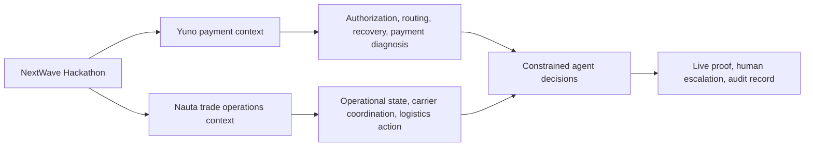

# Yuno, Nauta, and the hackathon

_Company and event context for the NextWave Hackathon 2026 challenge brief. Research reviewed 29 August 2026._

## What this page establishes

The NextWave Hackathon is reported as a Yuno event run with Nauta as a technology partner, with OpenAI providing technical support for the event. Two July 2026 reports describe the same partnership, dates, four-city format, 24-hour build window, and focus on payment infrastructure and agentic commerce: [Business Moment, 20 July 2026](https://businessmoment.com.br/yuno-nauta-e-openai-promovem-hackathon-de-ia-e-pagamentos-na-america-latina/) and [Brasil Inovador, 22 July 2026](https://brasilinovador.com.br/yuno-e-nauta-anunciam-o-nextwave-hackathon-2026-com-foco-em-ia-e-pagamentos/).

The supplied brief is the authority for the four challenge requirements, judging process, and deliverables. The public event reports explain why these companies are in the same event. They do not assign an author or owner to any individual challenge title.

## The shared problem space

Yuno works on the financial decision layer: which payment path to use, how to diagnose failed transactions, and how to keep payment operations under control. Nauta works on the operational decision layer: how to collect fragmented trade data, keep a current operational picture, and let agents act in logistics workflows.

The hackathon puts those two layers next to each other. Its challenges ask teams to build agents that can take constrained action, show the reason for that action, and leave a record that a person can inspect. That pattern applies to a payment authorization, a conversion incident, an adaptive operations screen, or a live logistics call.

The diagram is a problem-space map. It does not imply that Yuno and Nauta have a shared production system or that a challenge uses either company's API.

## Yuno in this brief

[Yuno](https://y.uno/en) describes itself as an AI-native operating system for global payments and financial services. Its public material covers payment collection and payout flows, fraud prevention, routing, retries, reconciliation, and AI agents for financial operations.

That context makes Challenge 01 and Challenge 02 the closest fit:

| Challenge | Connection to Yuno's public domain | What a team should prove |
| --- | --- | --- |
| [01: The Buyer Who Isn't Human](./challenge-01-buyer-who-isnt-human.md) | An agent makes a purchase under a spending mandate, handles merchant verification, and keeps an audit trail. This is a payment authorization and control problem. | The agent follows the mandate, handles failure or dispute paths, and makes each decision inspectable. |
| [02: The Control Tower](./challenge-02-control-tower.md) | A payment conversion drop must be detected, explained, and acted on. Yuno's public Payments Concierge material describes monitoring payment performance, finding causes of failures, and recommending action. | The team identifies the incident, separates a useful explanation from a dashboard observation, and shows an appropriate next action. |

The event coverage also describes the hackathon around agentic commerce, payment security, intelligent routing, and reconciliation. Those themes reinforce the connection, but they do not turn either challenge into a Yuno product specification.

## Nauta in this brief

[Nauta](https://www.getnauta.com/) describes its product as an operational brain for global trade. It says that its agents use information from email, spreadsheets, portals, ERP, TMS, and WMS systems. [Nauta's AI Workforce](https://www.getnauta.com/ai-workforce) names carrier and logistics activities such as shipment monitoring, root-cause analysis, carrier selection, freight anomaly detection, consolidation, and mode selection. Its public site also lists voice, email, SMS, Slack, and Teams as operational channels.

That context makes Challenge 04 the closest fit and makes Challenge 03 relevant to the same operational-agent pattern:

| Challenge | Connection to Nauta's public domain | What a team should prove |
| --- | --- | --- |
| [03: The Interface That Builds Itself](./challenge-03-interface-that-builds-itself.md) | The challenge turns current context into an interface and next actions. Nauta's public material supports the underlying operational-context and agent-action model. It does not document the exact generative UI behavior in the brief. | The interface changes because of available evidence, exposes the action path, and remains understandable when the data is incomplete. |
| [04: The Agent on the Line](./challenge-04-agent-on-the-line.md) | The challenge uses a drayage and carrier workflow, then requires agent communication, commitments, recaps, and escalation. This is directly in Nauta's logistics domain. | The agent handles a real conversation, respects its mandate, records the commitment, and hands control to a person when required. |

The available public material does not establish that Nauta negotiates drayage quotes by telephone. Treat that as a hackathon requirement, not as a documented Nauta feature.

## Track classification and its limit

| Company-domain alignment | Challenges | Confidence |
| --- | --- | --- |
| Yuno | 01 and 02 | Strong: both are payment authorization and payment-operations problems. |
| Nauta | 04 | Strong: it is a logistics coordination and carrier-communication problem. |
| Nauta, with a cross-cutting agent-interface component | 03 | Moderate: it fits Nauta's operational-context model, but generative UI is not a documented Nauta feature in the sources reviewed. |

No source reviewed explicitly says that Yuno owns Challenges 01 and 02, or that Nauta owns Challenges 03 and 04. This table classifies the challenges by company domain only. It must not be used as an official track assignment.

## What the companies add to the challenge design

The four tracks are easier to read when they are treated as variations of one operating model:

1. A system has partial, noisy, or changing information.
2. An agent receives authority bounded by policy, money, time, or a human approval path.
3. The agent acts through a real operational surface such as a payment flow, dashboard, interface, or telephone call.
4. The system shows what happened and why.

Yuno makes the first two payment-focused cases concrete. Nauta makes the operational-data and workflow cases concrete. The brief then raises the bar beyond a standard demo by requiring ugly cases, live judge interaction, failure handling, and technical defense. Read [the evaluation guidelines](./evaluation-guidelines.md) with the individual track documents before choosing a challenge.

## Evidence boundaries

Use each source for the claim it can support:

| Source | Use it for | Do not use it for |
| --- | --- | --- |
| Supplied hackathon brief | Track rules, trial by fire, deliverables, and judging requirements | Claims about the companies' current products |
| [Yuno's official site](https://y.uno/en) | Yuno's published payment and AI-agent positioning | Event rules or individual track ownership |
| [Nauta's official site](https://www.getnauta.com/) and [AI Workforce](https://www.getnauta.com/ai-workforce) | Nauta's published trade-operations and logistics-agent positioning | Proof of the exact phone-negotiation or generative-UI implementation |
| [Business Moment](https://businessmoment.com.br/yuno-nauta-e-openai-promovem-hackathon-de-ia-e-pagamentos-na-america-latina/) and [Brasil Inovador](https://brasilinovador.com.br/yuno-e-nauta-anunciam-o-nextwave-hackathon-2026-com-foco-em-ia-e-pagamentos/) | Reported event partnership, format, and high-level theme | Individual feature commitments or track ownership |

The two event articles are secondary reporting. They corroborate the partnership and event-level context. They are not substitutes for first-party product documentation.

## Sources

Primary company sources:

1. [Yuno official site](https://y.uno/en)
2. [Nauta official site](https://www.getnauta.com/)
3. [Nauta AI Workforce](https://www.getnauta.com/ai-workforce)

Event reporting:

1. [Business Moment: "Yuno, Nauta e OpenAI promovem hackathon de IA e pagamentos na América Latina", 20 July 2026](https://businessmoment.com.br/yuno-nauta-e-openai-promovem-hackathon-de-ia-e-pagamentos-na-america-latina/)
2. [Brasil Inovador: "Yuno e Nauta anunciam o NextWave Hackathon 2026 com foco em IA e pagamentos", 22 July 2026](https://brasilinovador.com.br/yuno-e-nauta-anunciam-o-nextwave-hackathon-2026-com-foco-em-ia-e-pagamentos/)
